# Industrial Engineering Visual Tools
## Jefferson County EMS Operational Analysis
**ISyE 450 Senior Design | University of Wisconsin-Madison | April 2026**

---

## Table of Contents

1. [Affinity Diagram](#1-affinity-diagram) — Stakeholder issues grouped into themed clusters
2. [Fishbone (Ishikawa) Diagram](#2-fishbone-ishikawa-diagram) — Root causes of persistent EMS coverage gaps
3. [5-Why Analysis](#3-5-why-analysis) — Causal chain for secondary ambulance gaps
4. [Pareto Chart](#4-pareto-chart) — 80/20 analysis of secondary ambulance demand
5. [Value Stream Map](#5-value-stream-map) — End-to-end EMS call response process
6. [Swimlane Diagram](#6-swimlane-diagram) — Dispatch & response flow across organizational lanes
7. [RACI Matrix](#7-raci-matrix) — Responsibility assignment for implementation
8. [Facility Location Matrix](#8-facility-location-matrix) — Weighted scoring for ambulance placement
9. [Radar Chart](#9-radar-chart) — Multi-dimensional department performance comparison
10. [Priority Matrix](#10-priority-matrix) — Urgency vs. impact for secondary coverage needs
11. [PDCA Cycle](#11-pdca-cycle) — Continuous improvement framework
12. [Gantt Chart](#12-gantt-chart) — Implementation timeline

---

## Diagnostic / Root Cause Tools

### 1. Affinity Diagram

Stakeholder issues from interviews, budgets, and operational data grouped into five themed clusters: Staffing & Workforce, Financial Sustainability, Coverage & Response Time, Governance & Contracts, and Equipment & Assets. Each sticky note represents a specific finding from primary data sources.

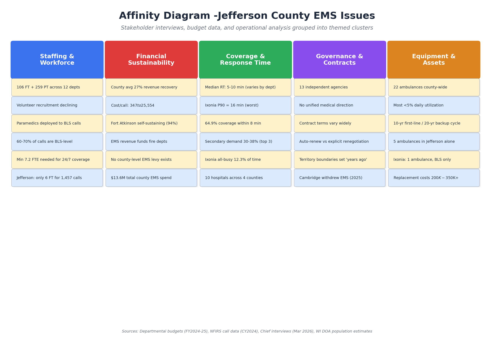

*Sources: Departmental budgets (FY2024-25), NFIRS call data (CY2024), Chief interviews (Mar 2026), WI DOA population estimates*

---

### 2. Fishbone (Ishikawa) Diagram

Root cause analysis of why EMS coverage gaps persist across Jefferson County. Six causal categories (Staffing, Funding, Geography, Governance, Equipment, Demand) branch into specific contributing factors identified through data analysis and chief interviews.

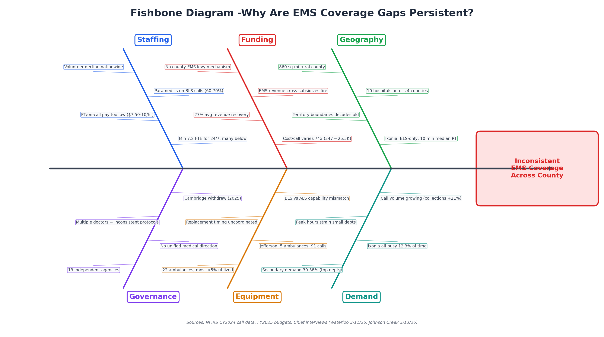

*Sources: NFIRS CY2024 call data, FY2025 budgets, Chief interviews (Waterloo 3/11/26, Johnson Creek 3/13/26)*

---

### 3. 5-Why Analysis

Traces the causal chain from the observable problem (long wait times when primary ambulance unavailable) through five levels to the root cause: no county-level governance structure to coordinate ambulance placement, staffing, or mutual aid dispatch.

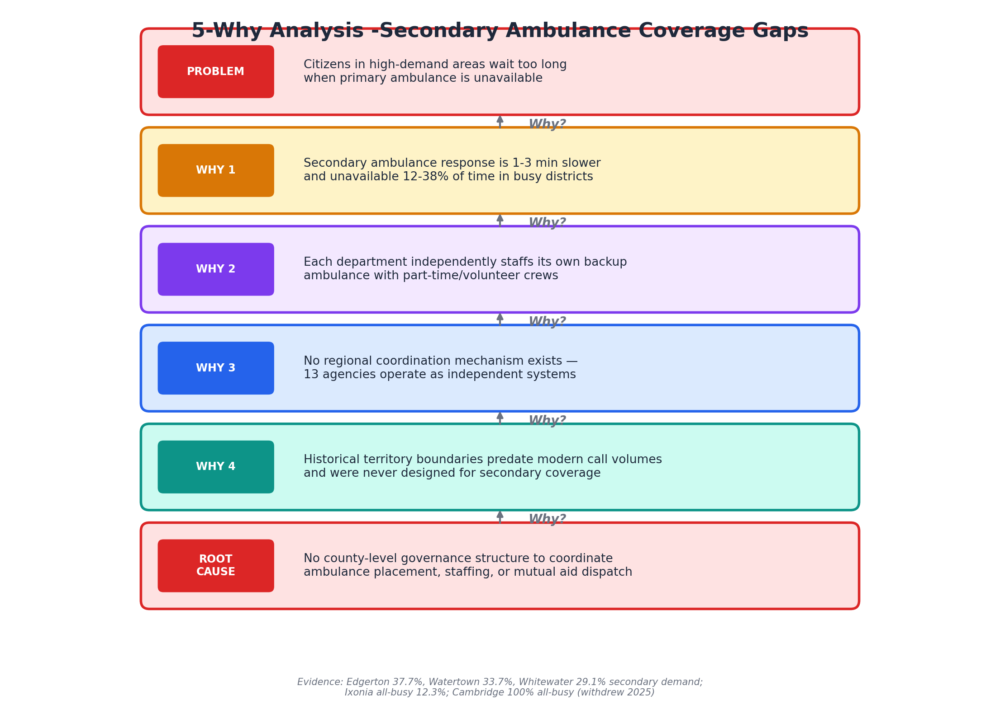

*Evidence: Edgerton 37.7%, Watertown 33.7%, Whitewater 29.1% secondary demand; Ixonia all-busy 12.3%; Cambridge 100% all-busy (withdrew 2025)*

---

### 4. Pareto Chart

Shows that Edgerton (768), Watertown (656), and Whitewater (421) account for 82% of all secondary ambulance events county-wide. The 80/20 principle suggests focusing the regional secondary network on these three districts first for maximum impact.

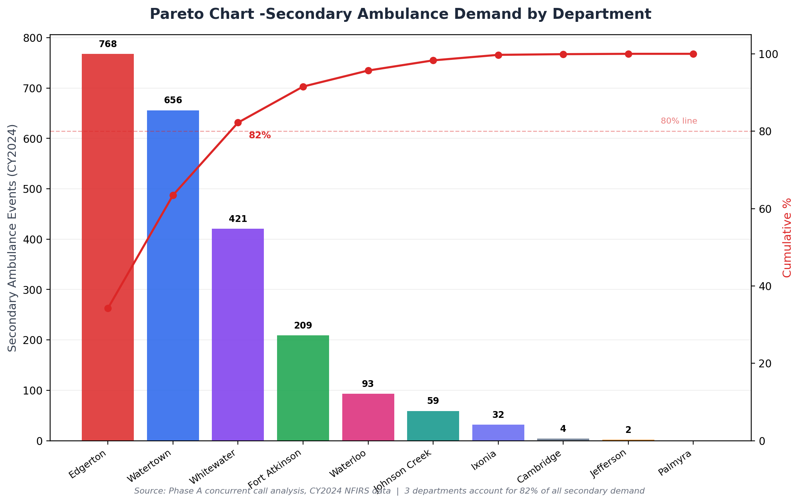

*Source: Phase A concurrent call analysis, CY2024 NFIRS data*

---

## Process & Flow Tools

### 5. Value Stream Map

Maps the end-to-end EMS call response process from 911 call through billing, identifying waste at each step. Key findings: dispatch lacks real-time unit location data, secondary response adds 1-3 minutes, BLS/ALS mismatch creates re-dispatch waste, and only 27% of billed revenue is collected.

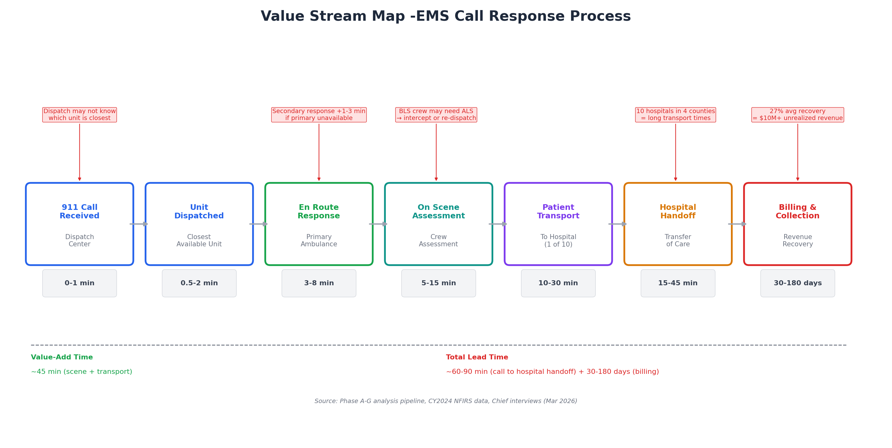

*Sources: Phase A-G analysis pipeline, CY2024 NFIRS data, Chief interviews (Mar 2026)*

---

### 6. Swimlane Diagram

Shows the EMS call flow across four organizational lanes (Dispatch, Primary Ambulance, Secondary/Mutual Aid, Hospital). Highlights that 30-38% of calls in top departments trigger the secondary path, adding complexity and response time delays.

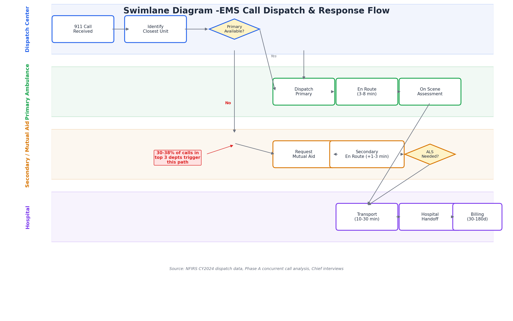

*Source: NFIRS CY2024 dispatch data, Phase A concurrent call analysis, Chief interviews*

---

## Planning & Decision Tools

### 7. RACI Matrix

Defines clear responsibility assignments for the regional secondary ambulance network implementation across six stakeholder groups. The County Board authorizes and funds; the EMS Working Group leads coordination; Department Chiefs execute operationally.

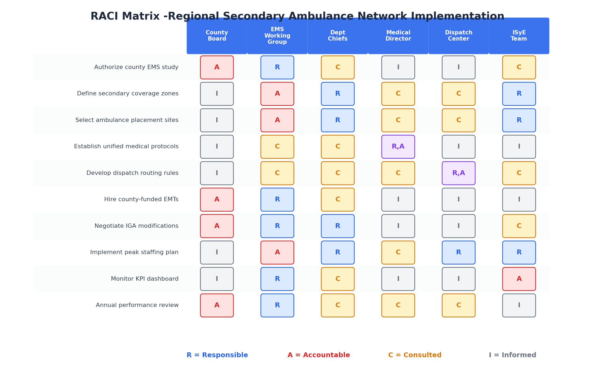

| | County Board | EMS Working Group | Dept Chiefs | Medical Director | Dispatch Center | ISyE Team |
|---|---|---|---|---|---|---|
| Authorize county EMS study | **A** | R | C | I | I | C |
| Define secondary coverage zones | I | **A** | R | C | C | R |
| Select ambulance placement sites | I | **A** | R | C | C | R |
| Establish unified medical protocols | I | C | C | **R,A** | I | I |
| Develop dispatch routing rules | I | C | C | C | **R,A** | C |
| Hire county-funded EMTs | **A** | R | C | I | I | I |
| Negotiate IGA modifications | **A** | R | R | I | I | C |
| Implement peak staffing plan | I | **A** | R | C | R | R |
| Monitor KPI dashboard | I | R | C | I | I | **A** |
| Annual performance review | **A** | R | C | C | C | I |

**R** = Responsible | **A** = Accountable | **C** = Consulted | **I** = Informed

---

### 8. Facility Location Matrix

Weighted scoring model for secondary ambulance placement candidates. Five criteria weighted by importance (coverage gap severity 30%, secondary volume 25%, RT improvement 20%, infrastructure 15%, cost 10%). Edgerton and Ixonia score highest.

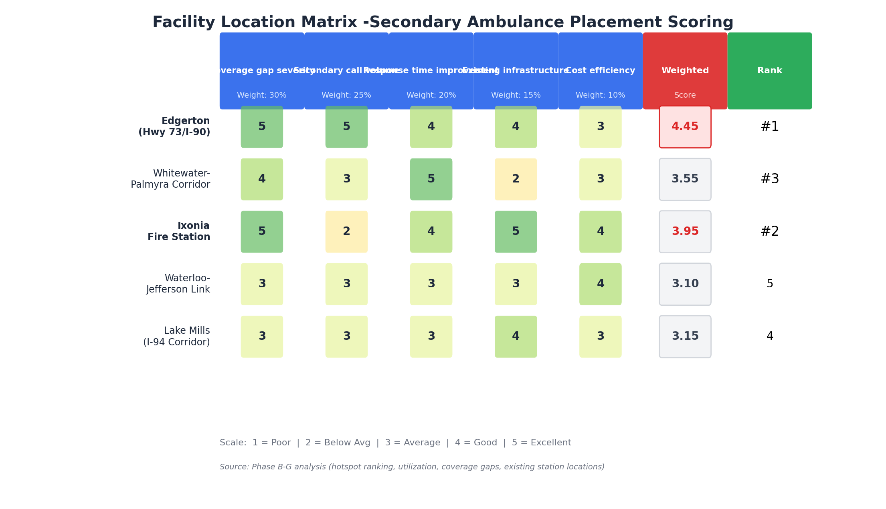

| Candidate Site | Coverage Gap (30%) | Secondary Volume (25%) | RT Improvement (20%) | Infrastructure (15%) | Cost Efficiency (10%) | **Weighted Score** | **Rank** |
|---|---|---|---|---|---|---|---|
| Edgerton (Hwy 73/I-90) | 5 | 5 | 4 | 4 | 3 | **4.35** | **1** |
| Ixonia Fire Station | 5 | 2 | 4 | 5 | 4 | **3.95** | **2** |
| Whitewater-Palmyra Corridor | 4 | 3 | 5 | 2 | 3 | **3.55** | **3** |
| Waterloo-Jefferson Link | 3 | 3 | 3 | 3 | 4 | **3.05** | **4** |
| Lake Mills (I-94 Corridor) | 3 | 3 | 3 | 4 | 3 | **3.15** | **5** |

*Scale: 1 = Poor | 2 = Below Avg | 3 = Average | 4 = Good | 5 = Excellent*

---

### 9. Radar Chart

Multi-dimensional comparison of seven departments across six performance metrics. Reveals that no single department excels on all dimensions — Fort Atkinson leads cost efficiency and revenue recovery, while Edgerton leads calls/FTE and utilization but has the highest secondary demand.

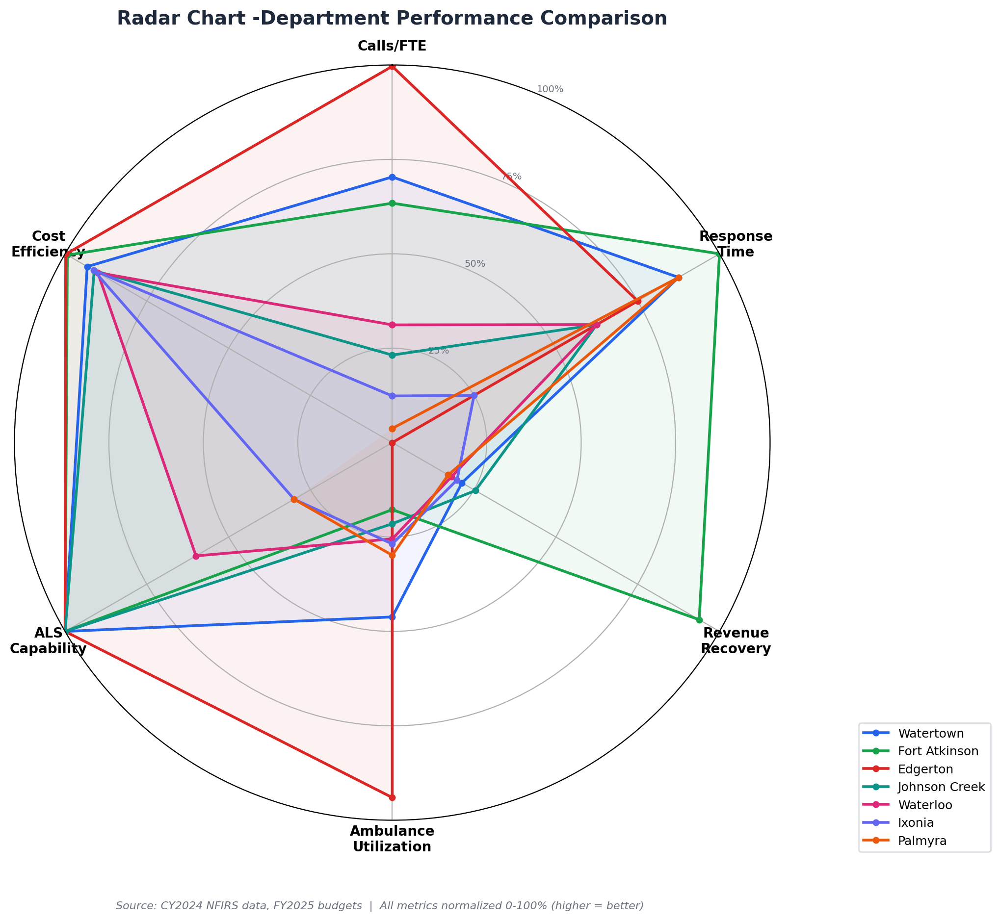

*Source: CY2024 NFIRS data, FY2025 budgets | All metrics normalized 0-100% (higher = better)*

---

### 10. Priority Matrix

Plots departments on urgency (coverage gap frequency) vs. impact (potential improvement from secondary coverage). Edgerton, Watertown, and Whitewater fall in the high-priority quadrant, confirming Pareto findings and supporting phased implementation starting with these districts.

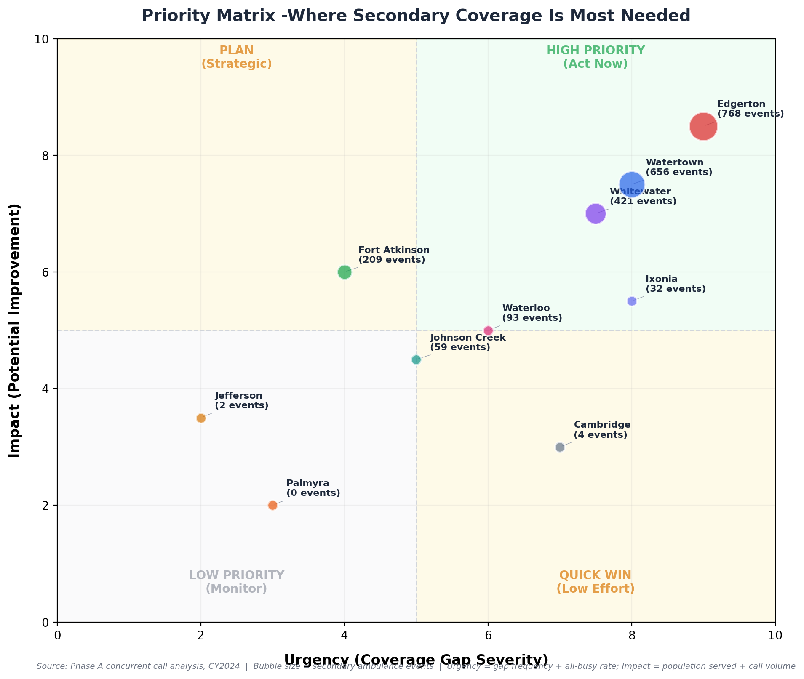

*Bubble size = secondary ambulance events | Urgency = gap frequency + all-busy rate | Impact = population served + call volume*

---

## Implementation Tools

### 11. PDCA Cycle

Continuous improvement framework for the regional secondary ambulance network implementation.

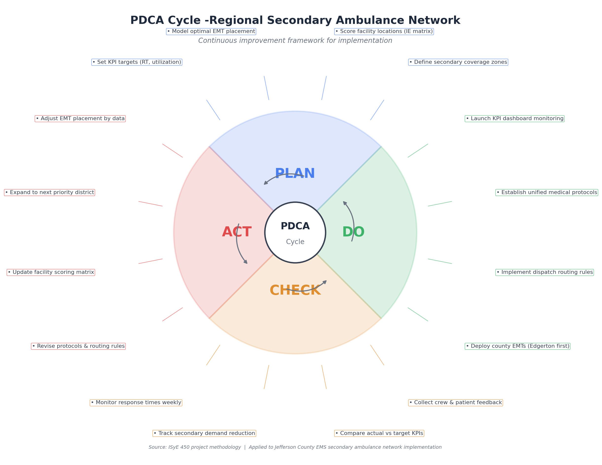

| Phase | Actions |
|---|---|
| **PLAN** | Define secondary coverage zones; Score facility locations (IE matrix); Model optimal EMT placement; Set KPI targets (RT, utilization) |
| **DO** | Deploy county EMTs (Edgerton first); Implement dispatch routing rules; Establish unified medical protocols; Launch KPI dashboard monitoring |
| **CHECK** | Monitor response times weekly; Track secondary demand reduction; Compare actual vs target KPIs; Collect crew & patient feedback |
| **ACT** | Adjust EMT placement by data; Expand to next priority district; Update facility scoring matrix; Revise protocols & routing rules |

*Source: ISyE 450 project methodology | Applied to Jefferson County EMS secondary ambulance network implementation*

---

### 12. Gantt Chart

Four-phase timeline from analysis (Jan-Apr 2026) through full deployment (Jun 2027). Current status: completing Phase 1 analysis. Phase 2 design begins upon Working Group approval. Pilot targets Edgerton as first deployment site (Jul 2026).

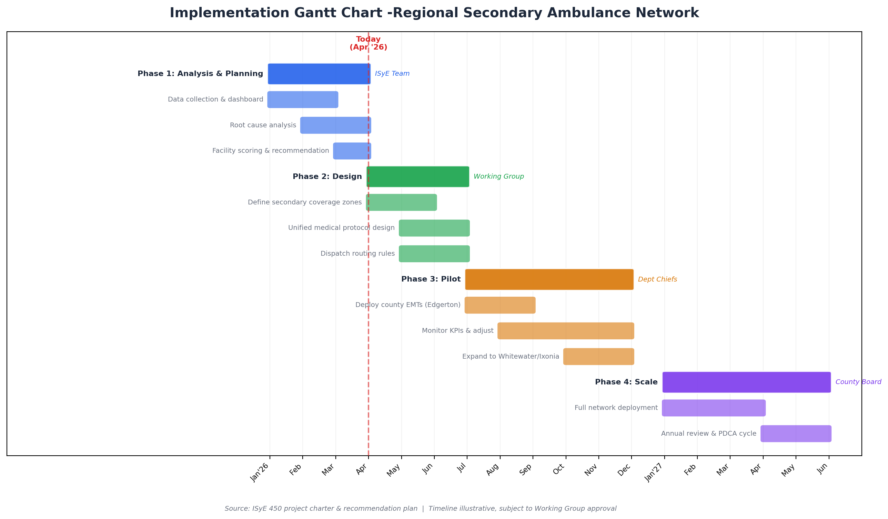

| Phase | Timeline | Owner | Key Activities |
|---|---|---|---|
| **Phase 1: Analysis & Planning** | Jan - Apr 2026 | ISyE Team | Data collection, dashboard, root cause analysis, facility scoring |
| **Phase 2: Design** | Apr - Jul 2026 | Working Group | Coverage zones, medical protocols, dispatch routing rules |
| **Phase 3: Pilot** | Jul - Dec 2026 | Dept Chiefs | Deploy county EMTs (Edgerton), monitor KPIs, expand to Whitewater/Ixonia |
| **Phase 4: Scale** | Jan - Jun 2027 | County Board | Full network deployment, annual review & PDCA cycle |

*Source: ISyE 450 project charter & recommendation plan | Timeline illustrative, subject to Working Group approval*

---

## Data Sources

All diagrams in this document are built from the following primary sources:

- **Call Data**: CY2024 NFIRS records (14,853 total EMS calls across 12 departments)
- **Financial Data**: FY2024-2025 departmental budgets and billing collections (Chief Association data)
- **Population**: WI Department of Administration 2025 estimates (county total: 86,855)
- **Interviews**: Waterloo Fire Chief (3/11/26), Johnson Creek Fire Chief (3/13/26)
- **Analysis Pipeline**: Phase A-G outputs (response times, concurrent calls, utilization, staffing, hotspots, baseline metrics)
- **Comparison Data**: County EMS comparison dataset (Portage, Bayfield benchmarks)
