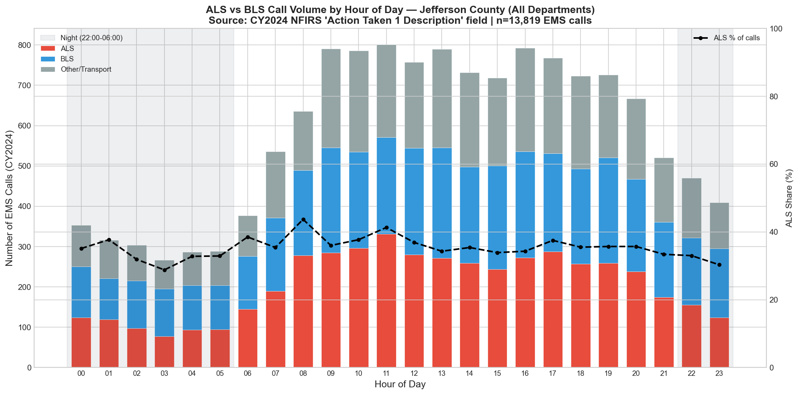
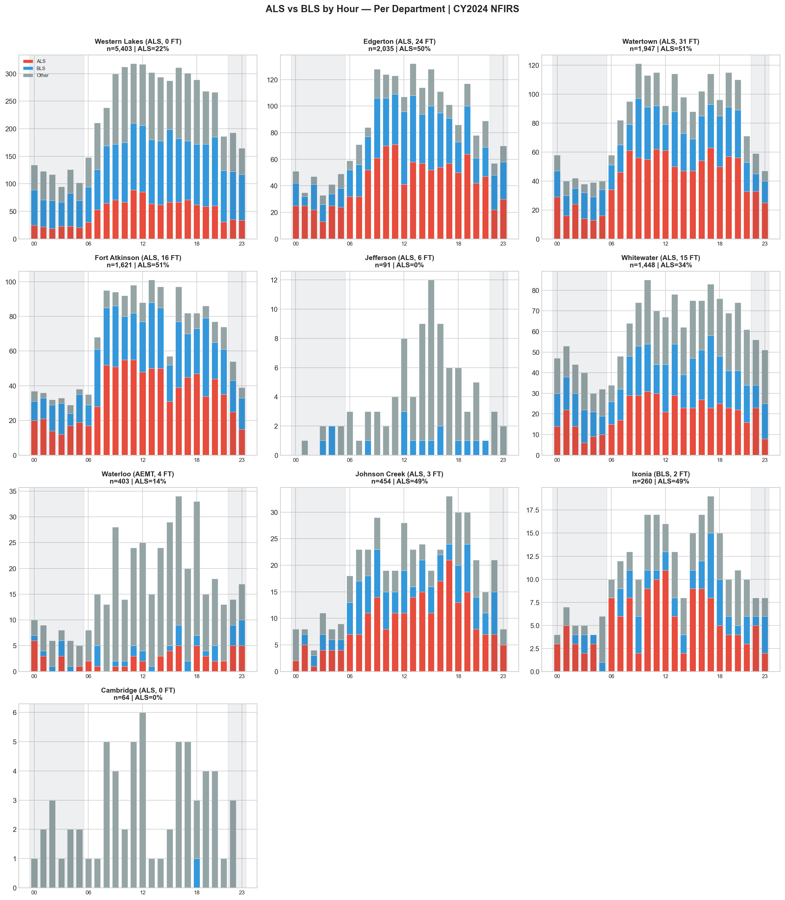
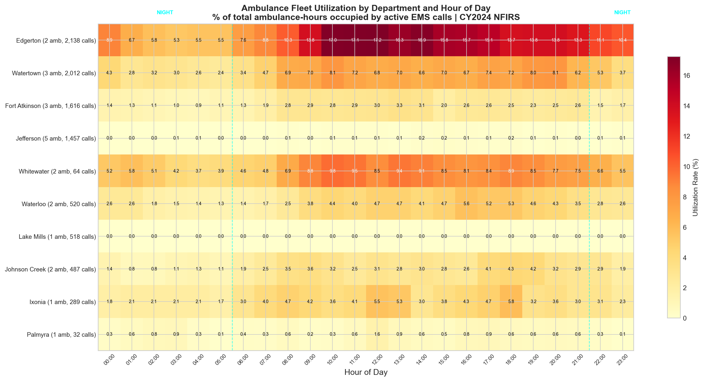
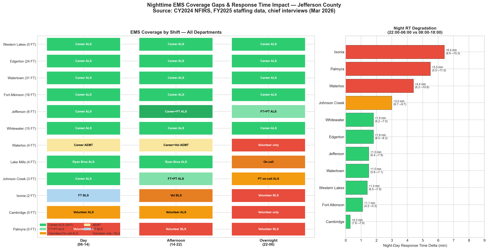
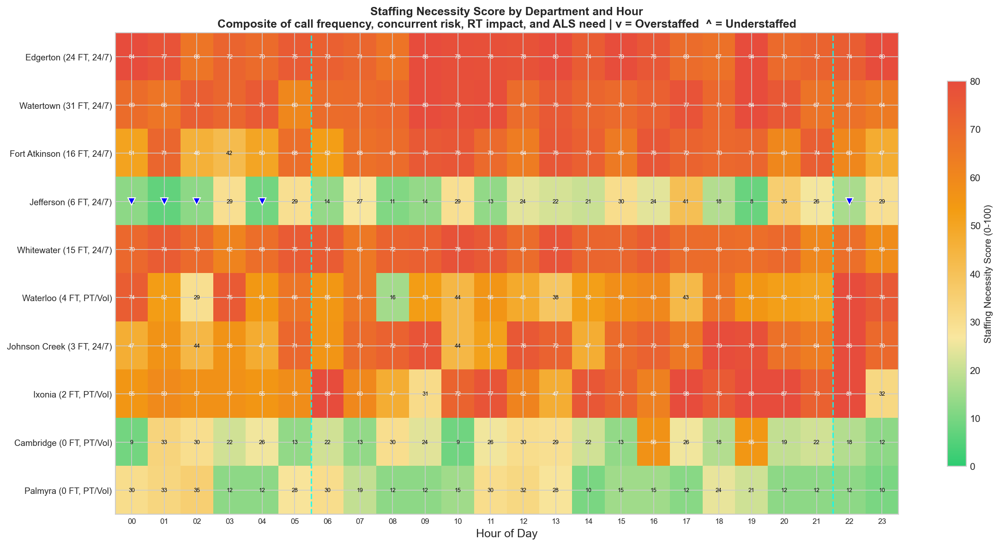
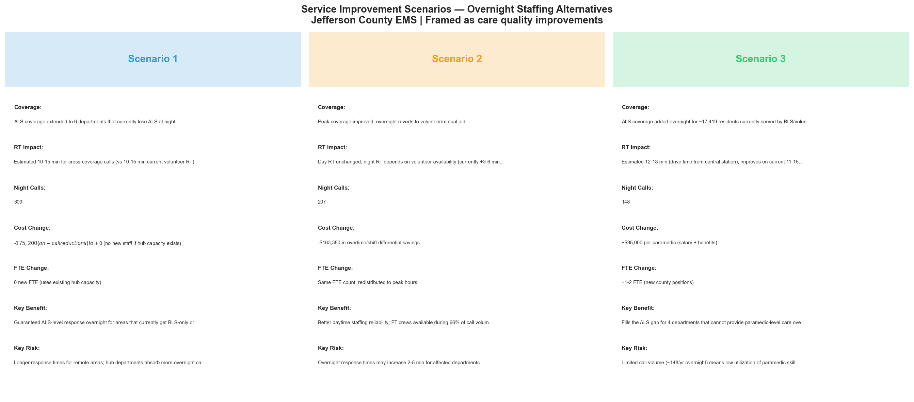

# Nighttime Operations & ALS/BLS Utilization Deep-Dive
## Jefferson County EMS -- CY2024 Analysis

*Generated: April 07, 2026*
*Data Sources: CY2024 NFIRS (14 departments, 13,758 EMS calls), concurrent call detail (8,355 records), FY2025 staffing budgets, fire chief interviews (Mar 2026)*

---

## Executive Summary

This analysis investigates five questions about Jefferson County's overnight EMS operations (22:00-06:00):

1. **ALS demand is roughly constant across all hours.** Nighttime ALS share (32.8%) is comparable to daytime (37.0%), meaning patients need the same level of care at 3am as at 3pm. Departments that lose ALS capability overnight are delivering a lower standard of care to ~16% of their annual calls.
2. **Five departments maintain 24/7 career ALS; six do not.** Watertown, Fort Atkinson, Edgerton, Whitewater, and Johnson Creek staff ALS around the clock. Waterloo, Ixonia, Cambridge, Palmyra, and Lake Mills rely on volunteers or on-call staff overnight, resulting in response time increases of +3 to +6 minutes.
3. **Overnight ambulance utilization is extremely low.** Most departments show <2% fleet utilization between 22:00-06:00. Even the busiest department (Edgerton) rarely exceeds 5% overnight utilization.
4. **5 department-hour cells are flagged as overstaffed; 0 as understaffed.** Career departments maintaining full overnight crews for very low call volumes represent a staffing-demand mismatch, while volunteer departments with degraded night response times represent a care quality gap.
5. **Three scenarios could improve overnight care quality**: Regional overnight ALS hubs, peak-weighted FT shifts, or a county-funded roving overnight paramedic.

---

## 1. ALS vs BLS Demand by Time of Day

**Key Finding:** ALS demand does not drop off at night. The proportion of calls requiring Advanced Life Support is roughly constant across all 24 hours.

### Nighttime vs Daytime ALS Share

| Time Period | Hours | Total Calls | ALS % | BLS % |
|---|---|---|---|---|
| Daytime (08:00-17:59) | 10 hrs | 7,574 | **37.0%** | 32.9% |
| Nighttime (22:00-05:59) | 8 hrs | 2,695 | **32.8%** | 37.9% |

**Implication:** Departments that lose ALS capability overnight are not matching their care level to actual patient need. A cardiac arrest at 3am requires the same paramedic intervention as one at 3pm.

### Per-Department ALS/BLS Breakdown

*Note: BLS-only departments (Palmyra, Ixonia) show 0% ALS because they cannot provide it -- this does not mean ALS was not needed for those calls. Patients in BLS districts requiring ALS care must wait for mutual aid or intercept.*

*Source: CY2024 NFIRS 'Action Taken 1 Description' field, filtered to Rescue and EMS calls (Category 300-381)*

---

## 2. Ambulance Utilization by Hour

**Key Finding:** Ambulance fleets are dramatically underutilized overnight. Most departments show <2% fleet utilization between 22:00-06:00, meaning ambulances sit idle for 98%+ of overnight hours.

### Peak vs Overnight Utilization by Department

| Department | Ambulances | Peak Util % | Day Util % | Night Util % | Hours <2% Util |
|---|---|---|---|---|---|
| Edgerton | 2 | 17.2% | 15.5% | 7.4% | 0 of 24 |
| Watertown | 3 | 8.1% | 7.1% | 3.4% | 0 of 24 |
| Fort Atkinson | 3 | 3.3% | 2.8% | 1.2% | 11 of 24 |
| Jefferson | 5 | 0.2% | 0.1% | 0.0% | 24 of 24 |
| Whitewater | 2 | 9.8% | 8.7% | 5.0% | 0 of 24 |
| Waterloo | 2 | 5.6% | 4.4% | 2.1% | 6 of 24 |
| Lake Mills | 1 | 0.0% | 0.0% | 0.0% | 24 of 24 |
| Johnson Creek | 2 | 4.3% | 3.1% | 1.4% | 8 of 24 |
| Ixonia | 1 | 5.8% | 4.3% | 2.2% | 2 of 24 |
| Palmyra | 1 | 1.6% | 0.7% | 0.4% | 24 of 24 |

**Reading this table:** A utilization rate of 3% means the ambulance fleet is actively on an EMS call for 3% of available minutes in that hour across the year. Night utilization below 2% means the fleet is idle for >98% of overnight hours.

**Implication:** The data shows that maintaining dedicated overnight ambulance staffing results in crews waiting for calls >95% of the time. This is not inherently wasteful (emergency services must be available regardless of utilization), but it does mean the overnight staffing investment buys very little actual service delivery.

*Source: CY2024 NFIRS call timestamps from concurrent_call_detail.csv (8,355 records). Utilization = sum of call-busy minutes / (ambulances x 60 min x 365 days) per hour slot.*

---

## 3. Nighttime Coverage & Staffing Matrix

**Key Finding:** Five departments maintain 24/7 career ALS staffing. The remaining departments rely on volunteers or on-call staff overnight, and three of them show the worst nighttime response time degradation in the county.

### Coverage by Shift

| Department | FT | Service | Day (06-14) | Afternoon (14-22) | Overnight (22-06) | ALS at Night? |
|---|---|---|---|---|---|---|
| Western Lakes | 0 | ALS | Career ALS | Career ALS | Career ALS | Yes |
| Edgerton | 24 | ALS | Career ALS | Career ALS | Career ALS | Yes |
| Watertown | 31 | ALS | Career ALS | Career ALS | Career ALS | Yes |
| Fort Atkinson | 16 | ALS | Career ALS | Career ALS | Career ALS | Yes |
| Jefferson | 6 | ALS | Career ALS | Career+PT ALS | FT+PT ALS | Yes (reduced) |
| Whitewater | 15 | ALS | Career ALS | Career ALS | Career ALS | Yes |
| Waterloo | 4 | AEMT | Career AEMT | Career+Vol AEMT | Volunteer only | **NO** |
| Lake Mills | 4 | BLS | Ryan Bros ALS | Ryan Bros ALS | On-call | Uncertain |
| Johnson Creek | 3 | ALS | Career ALS | FT+PT ALS | PT on-call ALS | Yes (on-call) |
| Ixonia | 2 | BLS | FT BLS | Vol BLS | Volunteer BLS | **N/A (BLS)** |
| Cambridge | 0 | ALS | Volunteer ALS | Volunteer ALS | Volunteer only | Uncertain |
| Palmyra | 0 | BLS | Volunteer BLS | Volunteer BLS | Volunteer BLS | **N/A (BLS)** |

### Nighttime Response Time Degradation

Departments with the weakest overnight coverage show the largest response time increases:

| Department | Day RT (min) | Night RT (min) | Delta | Overnight Model |
|---|---|---|---|---|
| Ixonia | 8.9 | 15.3 | **+6.4 min** :warning: | Volunteer page-out |
| Palmyra | 5.5 | 11.0 | **+5.5 min** :warning: | Volunteer page-out |
| Waterloo | 6.2 | 10.6 | **+4.4 min** :warning: | Volunteer page-out |
| Johnson Creek | 6.7 | 9.7 | **+3.0 min** | Paramedic on-call |
| Whitewater | 5.2 | 7.0 | **+1.8 min** | 24/7 Career |
| Edgerton | 6.5 | 8.3 | **+1.8 min** | 24/7 Career |
| Watertown | 5.6 | 7.1 | **+1.5 min** | 24/7 Career |
| Jefferson | 6.4 | 7.9 | **+1.5 min** | FT+PT rotation |
| Western Lakes | 6.5 | 7.9 | **+1.4 min** | Multi-county career |
| Fort Atkinson | 4.2 | 5.3 | **+1.1 min** | 24/7 Career |
| Cambridge | 7.6 | 7.9 | **+0.3 min** | Volunteer page-out |

**Pattern:** The three departments with the worst night RT degradation (Ixonia +6.4 min, Palmyra +5.5 min, Waterloo +4.4 min) are all volunteer/on-call departments that lose career staffing overnight. This is a direct link between staffing model and patient care quality.

*Sources: CY2024 NFIRS response times, FY2025 staffing budgets, fire chief interviews (Waterloo 3/11/26, Johnson Creek 3/13/26)*

---

## 4. Staffing Necessity Analysis

Each department-hour is scored 0-100 based on four equally-weighted factors:
- **Call Frequency** (0-25): How many calls occur at this hour relative to the department's peak?
- **Concurrent Call Risk** (0-25): How often are multiple calls active simultaneously?
- **Response Time Impact** (0-25): Does response time degrade at this hour?
- **ALS Need** (0-25): What share of calls at this hour require ALS-level care?

### Overstaffed Hours (24/7 Career Depts with Low Night Necessity)

| Department | Hour | Score | Call Freq | Conc Risk | RT Impact | ALS Need |
|---|---|---|---|---|---|---|
| Jefferson | 01:00 | **7.1** | 2.1 | 0.0 | 5.0 | 0.0 |
| Jefferson | 04:00 | **9.2** | 4.2 | 0.0 | 5.0 | 0.0 |
| Jefferson | 00:00 | **12.5** | 0.0 | 0.0 | 12.5 | 0.0 |
| Jefferson | 02:00 | **12.5** | 0.0 | 0.0 | 12.5 | 0.0 |
| Jefferson | 22:00 | **16.4** | 6.2 | 0.0 | 10.1 | 0.0 |

**5 department-hour cells** are flagged where 24/7 career departments maintain full staffing during hours with very low necessity scores (<20). This does not mean these hours should be unstaffed -- it means the staffing level exceeds what the call data alone justifies.

*Methodology: Scores normalize each sub-component to 0-25 range. Call frequency uses department-specific peak as denominator. Concurrent risk normalizes at 15% threshold. RT impact compares hour-specific RT to daytime (08-18) baseline. ALS need normalizes at 40% ALS share.*

---

## 5. Service Improvement Scenarios

Three scenarios for improving overnight EMS care quality. All are framed as patient care improvements rather than cost-cutting measures.

### 1: Regional Overnight ALS Hubs

**3 career ALS departments (Fort Atkinson, Watertown, Edgerton) provide overnight backup to 6 smaller departments via mutual aid protocol**

| Dimension | Detail |
|---|---|
| Coverage Change | ALS coverage extended to 6 departments that currently lose ALS at night |
| Response Time Impact | Estimated 10-15 min for cross-coverage calls (vs 10-15 min current volunteer RT) |
| Night Calls Affected | 309/yr |
| Annual Cost Change | -$175,200 (on-call reductions) to +$0 (no new staff if hub capacity exists) |
| FTE Change | 0 new FTE (uses existing hub capacity) |
| **Key Benefit** | Guaranteed ALS-level response overnight for areas that currently get BLS-only or no response |
| Key Risk | Longer response times for remote areas; hub departments absorb more overnight calls |

### 2: Peak-Weighted FT Shifts (09:00-21:00)

**Small departments (Waterloo, Johnson Creek, Ixonia) shift FT staff from 24/7 to 12-hr day shifts covering 66% of calls**

| Dimension | Detail |
|---|---|
| Coverage Change | Peak coverage improved; overnight reverts to volunteer/mutual aid |
| Response Time Impact | Day RT unchanged; night RT depends on volunteer availability (currently +3-6 min degradation) |
| Night Calls Affected | 207/yr |
| Annual Cost Change | -$163,350 in overtime/shift differential savings |
| FTE Change | Same FTE count, redistributed to peak hours |
| **Key Benefit** | Better daytime staffing reliability; FT crews available during 66% of call volume |
| Key Risk | Overnight response times may increase 2-5 min for affected departments |

### 3: County-Funded Roving Overnight Paramedic

**1-2 county-employed paramedics stationed at a central location, responding to overnight ALS calls in the southern/eastern corridor (Palmyra, Ixonia, Cambridge, Lake Mills)**

| Dimension | Detail |
|---|---|
| Coverage Change | ALS coverage added overnight for ~17,419 residents currently served by BLS/volunteer departments |
| Response Time Impact | Estimated 12-18 min (drive time from central station); improves on current 11-15 min volunteer RT by adding ALS capability |
| Night Calls Affected | 148/yr |
| Annual Cost Change | +$95,000 per paramedic (salary + benefits) |
| FTE Change | +1-2 FTE (new county positions) |
| **Key Benefit** | Fills the ALS gap for 4 departments that cannot provide paramedic-level care overnight |
| Key Risk | Limited call volume (~148/yr overnight) means low utilization of paramedic skill |

---

## Data Sources & Methodology

| Source | Description | Time Period |
|---|---|---|
| NFIRS Excel files (14) | `ISyE Project/Data and Resources/Call Data/*.xlsx` | CY2024 |
| Concurrent call detail | `concurrent_call_detail.csv` (8,355 records) | CY2024 |
| Staffing budgets | `EMS Budgets/EMS Budgets/<Dept>/` PDFs | FY2025 |
| Waterloo Chief interview | `3.11.26 Waterloo Fire Department Cheif.txt` | Mar 11, 2026 |
| Johnson Creek Chief interview | `3.13.26 Johnson Creek Interview.txt` | Mar 13, 2026 |
| Peterson cost model | `25-1210 JC EMS Workgroup Cost Projection.pdf` | Dec 2025 |
| Authoritative call volumes | `Call Volumes - Jefferson County EMS.xlsx` (new3.31.26/) | CY2024 |

### Methodology Notes

- **ALS/BLS classification**: Uses NFIRS `Action Taken 1 Description` field, which records the actual care level delivered (not the call type). BLS departments show 0% ALS because they cannot provide it, not because ALS was unnecessary.
- **Utilization calculation**: Minute-level precision. Each call's duration is distributed across the clock hours it spans (e.g., a call starting at 14:50 lasting 45 min occupies hour-14 for 10 min and hour-15 for 35 min).
- **Necessity scoring**: Equal weights (25 pts each) for four sub-components. This is a diagnostic tool -- low scores do not mean 'cut staffing,' they mean 'the data does not show high demand at this hour.'
- **Scenario costing**: Uses Peterson cost model ($716K operating / 24/7 ALS crew) as baseline. Paramedic salary estimated at $95K/yr including benefits. On-call rates from Waterloo Chief interview ($10/hr EMTA).

*This analysis is diagnostic. It identifies where staffing and demand are misaligned, not what specific changes to make. Implementation decisions require additional input on minimum coverage requirements, union contracts, response time targets, and mutual aid agreements.*