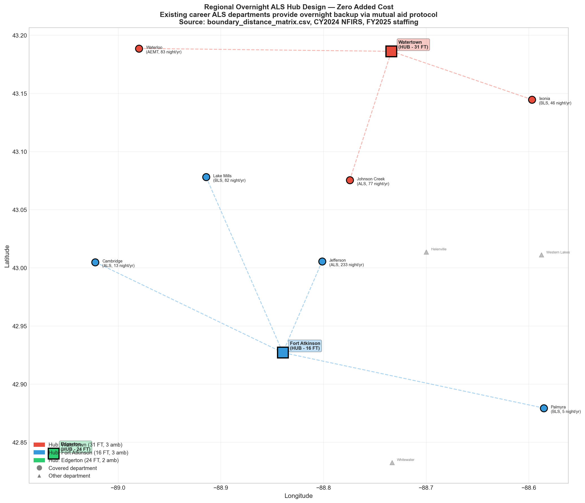
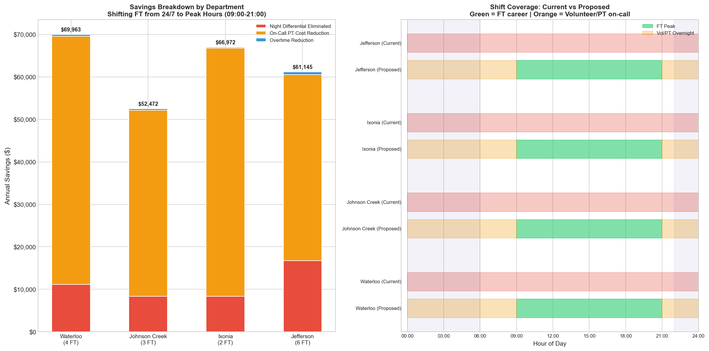
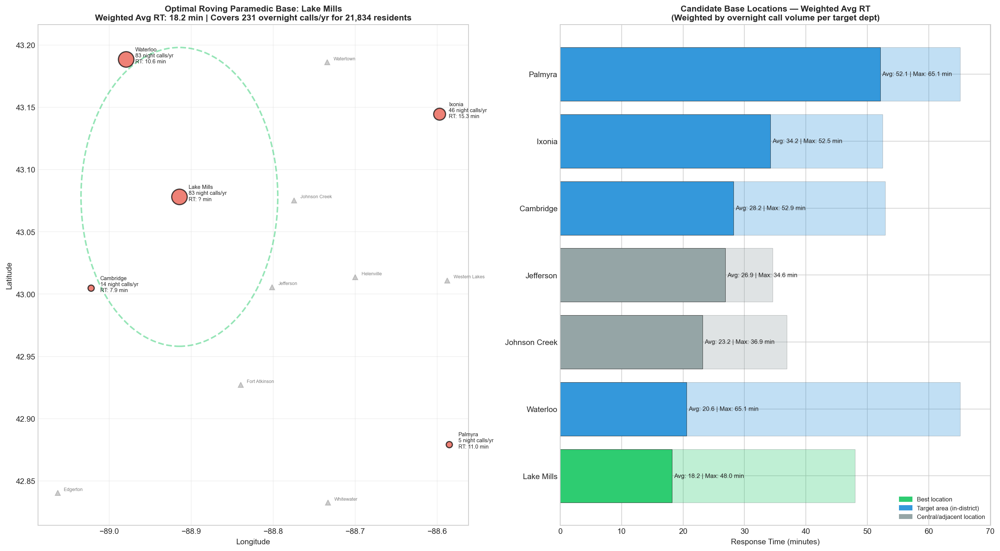

# Staffing Reallocation & Scenario Recommendations
## Jefferson County EMS -- Deep-Dive on Overnight Staffing Alternatives

*Generated: April 07, 2026*
*Data Sources: CY2024 NFIRS (14 departments, 13,758 EMS calls), boundary distance matrix, FY2025 budgets, Peterson cost model, fire chief interviews (Mar 2026)*

---

## Executive Summary

This document provides actionable detail on three staffing strategies identified in the Nighttime Operations Deep-Dive:

1. **Where to reduce/add staffing**: Jefferson's overnight career staffing handles just 0.05 calls/hour; Ixonia, Palmyra, and Waterloo lose ALS at night and see +4-6 min response time increases.
2. **Regional Overnight ALS Hubs**: Three existing career departments (Watertown, Fort Atkinson, Edgerton) can provide overnight ALS backup to 7 smaller departments at **zero additional cost** -- they already staff 24/7.
3. **Peak-Weighted FT Shifts**: Shifting 4 departments from 24/7 to 12-hr peak coverage (09:00-21:00) saves an estimated **$250,553/year** while covering 66% of their annual call volume with career staff.
4. **County-Funded Roving Paramedic**: A single paramedic stationed at **Lake Mills** covers 231 overnight calls/year across 5 underserved departments (21,834 residents) at **$95,000/year**.

---

## 1. Where to Reduce and Where to Add Staffing

### Departments Where Overnight Staffing Exceeds Demand

These departments maintain 24/7 career staffing despite very low overnight call volume and utilization:

| Department | FT | Service | Night Calls/Yr | Night Util % | Night Necessity Score | Recommendation |
|---|---|---|---|---|---|---|
| **Jefferson** | 6 | ALS | 233 | 0.0% | 18.2 | REDUCE: Low night demand, career staff idle |

**Jefferson is the clearest case.** With 6 FT staff providing 24/7 ALS coverage, the department handles only ~233 overnight calls/year (0.64/night). Five overnight hours scored below 20 on the staffing necessity index. The department also operates 5 ambulances for 1,457 calls -- the lowest calls-per-ambulance ratio in the county (291 vs national benchmark of 1,147).

### Departments Where Overnight Staffing Falls Short

These departments show significant response time degradation overnight, indicating inadequate staffing:

| Department | FT | Service | Night Model | Night RT (min) | Day RT (min) | Delta | Impact |
|---|---|---|---|---|---|---|---|
| **Ixonia** | 2 | BLS | Vol/On-call | 15.3 | 8.9 | **+6.4 min** | Patients wait 6.4 min longer at night |
| **Palmyra** | 0 | BLS | Vol/On-call | 11.0 | 5.5 | **+5.5 min** | Patients wait 5.5 min longer at night |
| **Waterloo** | 4 | AEMT | Vol/On-call | 10.6 | 6.2 | **+4.4 min** | Patients wait 4.4 min longer at night |

**Ixonia (+6.4 min) and Palmyra (+5.5 min) are the worst cases.** Both are BLS-only volunteer departments. At night, response times stretch to 15.3 and 11.0 minutes respectively -- well above the NFPA 1710 standard of 8 minutes for ALS arrival. Patients in these areas who need ALS at night must wait for mutual aid from a career department.

---

## 2. Regional Overnight ALS Hubs — How They Work

### Concept

Three career ALS departments -- **Watertown, Fort Atkinson, and Edgerton** -- already staff full-time ALS crews 24 hours a day, 7 days a week. They are paying for overnight crews regardless of whether those crews handle additional mutual aid calls. By formalizing these departments as overnight ALS hubs, the county gains regional ALS coverage for 7 smaller departments **at zero incremental cost** to the hub departments.

### How It Works

1. **Overnight hours (22:00-06:00):** When a call comes in to a smaller department and their volunteer/on-call crew is unavailable or the call requires ALS, the nearest hub is automatically dispatched as backup.
2. **Primary still responds first:** The local department's volunteer crew still responds. The hub provides ALS-level backup, not replacement.
3. **Dispatch protocol change:** County dispatch routes overnight ALS requests to the nearest hub instead of relying on volunteer callback.
4. **No new staff, no new equipment:** Hub departments already have idle overnight capacity (utilization is 2-8% overnight). Adding a few mutual aid calls does not require additional crews.

### Hub Assignments (by shortest drive time)

| Department | Service | Current Night Model | Assigned Hub | Distance (mi) | Drive Time (min) | Current Night RT | Est. Hub RT |
|---|---|---|---|---|---|---|---|
| Waterloo | AEMT | Volunteer/On-call | **Watertown** | 12.4 | 27.6 | 10.6 min | 20.9 min |
| Ixonia | BLS | Volunteer/On-call | **Watertown** | 7.5 | 16.6 | 15.3 min | 15.4 min |
| Palmyra | BLS | Volunteer/On-call | **Fort Atkinson** | 13.3 | 29.6 | 11.0 min | 20.1 min |
| Cambridge | ALS | Volunteer/On-call | **Fort Atkinson** | 10.7 | 23.8 | 7.9 min | 17.2 min |
| Lake Mills | BLS | Volunteer/On-call | **Fort Atkinson** | 11.1 | 24.7 | nan min | 17.7 min |
| Johnson Creek | ALS | 24/7 Career | **Watertown** | 7.9 | 17.7 | 9.7 min | 15.9 min |
| Jefferson | ALS | 24/7 Career | **Fort Atkinson** | 5.8 | 12.8 | 7.9 min | 11.7 min |

### Hub Workload Impact

| Hub | Own Night Calls/Yr | Added Night Calls/Yr | Total Night Calls/Yr | Calls/Night | Departments Covered | FT Staff | Ambulances |
|---|---|---|---|---|---|---|---|
| **Watertown** | 321 | 206 | 527 | 1.44 | Waterloo, Ixonia, Johnson Creek | 31 | 3 |
| **Fort Atkinson** | 258 | 333 | 591 | 1.62 | Palmyra, Cambridge, Lake Mills, Jefferson | 16 | 3 |
| **Edgerton** | 342 | 0 | 342 | 0.94 |  | 24 | 2 |

### Why Zero Added Cost

| Factor | Detail |
|---|---|
| Existing staff | Hub departments already employ 24/7 career ALS crews (Watertown 31 FT, Fort Atkinson 16 FT, Edgerton 24 FT) |
| Low overnight utilization | Hub ambulance fleets are 2-8% utilized overnight -- ample capacity for additional calls |
| Low added volume | Total additional overnight calls across all hubs: ~539/year = ~1.5/night -- spread across 3 hubs |
| Already responding to mutual aid | These departments already handle some mutual aid calls overnight informally |
| Revenue offset | Hub departments collect billing revenue on any transport they perform |

### Limitations

- **Response time trade-off:** Hub response to distant departments (e.g., Edgerton → Palmyra: 24 mi, ~34 min drive) may be slow. For the farthest assignments, the hub serves as ALS backup *after* local BLS arrives first.
- **Hub crew unavailability:** If the hub's crew is already on a call, the next-nearest hub responds. With 3 hubs, the probability all 3 are busy overnight simultaneously is extremely low.
- **Requires dispatch protocol update:** County dispatch must be configured to route overnight ALS requests to hubs.

---

## 3. Peak-Weighted FT Shifts — Mechanics and Savings

### Concept

Four departments currently spread their full-time staff across all shifts including overnight, despite overnight call volume being 3-5x lower than daytime. By concentrating FT coverage into a 12-hour peak window (09:00-21:00), these departments cover **66% of their annual call volume** with career staff while using volunteers/PT for the low-volume overnight hours.

### How It Works

| Current (24/7) | Proposed (Peak-Weighted) |
|---|---|
| FT crew on station 00:00-08:00 (night shift) | Volunteer/PT on-call 00:00-09:00 |
| FT crew on station 08:00-16:00 (day shift) | **FT crew on station 09:00-21:00** |
| FT crew on station 16:00-00:00 (swing shift) | Volunteer/PT on-call 21:00-00:00 |
| 3 shifts = FT spread thin | **1 long shift = FT concentrated at peak** |

The 09:00-21:00 window is chosen because it captures:
- **66% of all countywide EMS calls** (9,012 of 13,758)
- The **peak demand hours** (11:00-19:00, which alone account for 31% of calls)
- The **afternoon gap** when PT/volunteers are least available (they have day jobs)

### Savings Breakdown by Department

| Department | FT | Current Model | Proposed | Night Diff Saved | On-Call Saved | OT Saved | **Total Savings** |
|---|---|---|---|---|---|---|---|
| Waterloo | 4 | 3 shifts (24/7) | Peak 09-21 + Vol overnight | $11,163 | $58,400 | $400 | **$69,963** |
| Johnson Creek | 3 | 3 shifts (24/7) | Peak 09-21 + Vol overnight | $8,372 | $43,800 | $300 | **$52,472** |
| Ixonia | 2 | 2 shifts | Peak 09-21 + Vol overnight | $8,372 | $58,400 | $200 | **$66,972** |
| Jefferson | 6 | 3 shifts (24/7) | Peak 09-21 + Vol overnight | $16,745 | $43,800 | $600 | **$61,145** |
| **TOTAL** | | | | | | | **$250,553** |

### Where the Savings Come From

1. **Night shift differential eliminated (~10% of salary):** FT staff working overnight typically receive a 10-15% night differential. By eliminating the overnight FT shift, this premium is no longer paid. Staff work the same total hours but during peak daytime/evening hours.

2. **On-call PT cost reduction:** Departments currently paying PT staff $10/hr (AEMT) or $7.50/hr (EMR) to be on-call overnight can reduce this. With Regional Hub backup (Section 2), overnight on-call requirements decrease.
   - *Source: Waterloo Chief Interview, Mar 11, 2026 — confirmed $10/hr AEMT, $7.50/hr EMR driver rates*

3. **Overtime reduction:** Better peak coverage means fewer overtime callbacks during busy afternoon hours. Currently, when daytime staff are stretched, departments call in off-duty FT or PT at overtime rates. Concentrating FT in the peak window reduces this.

### What Happens Overnight Under This Model

| Department | Night Calls/Yr | Calls/Night | Coverage Model |
|---|---|---|---|
| Waterloo | 83 | 0.28 | Volunteer/PT on-call + Regional Hub ALS backup |
| Johnson Creek | 77 | 0.21 | Volunteer/PT on-call + Regional Hub ALS backup |
| Ixonia | 46 | 0.13 | Volunteer/PT on-call + Regional Hub ALS backup |
| Jefferson | 233 | 0.76 | Volunteer/PT on-call + Regional Hub ALS backup |

At 0.13-0.76 calls per night, these departments average less than 1 call per overnight period. Volunteer/PT on-call is defensible at this volume, especially with Regional Hub ALS backup available.

---

## 4. County-Funded Roving Paramedic — Location and Sizing

### The Problem

Five departments covering ~21,834 residents lack reliable ALS coverage overnight:

| Department | Population | Night Calls/Yr | Service Level | Night RT (min) | ALS at Night? |
|---|---|---|---|---|---|
| Ixonia | 5,078 | 46 | BLS | 15.3 | No |
| Lake Mills | 6,200 | 83 | BLS | ? | Uncertain (private contractor) |
| Waterloo | 4,415 | 83 | AEMT | 10.6 | No (volunteer only) |
| Cambridge | 2,800 | 14 | ALS (vol) | 7.9 | Uncertain (volunteer) |
| Palmyra | 3,341 | 5 | BLS | 11.0 | No |
| **Total** | **21,834** | **231** | | | |

### Optimal Location: Lake Mills

The analysis tested 7 candidate base locations, weighing average response time by overnight call volume at each target department:

| Rank | Base Location | Avg Weighted RT (min) | Max RT (min) | In Target Area? |
|---|---|---|---|---|
| 1 | Lake Mills **BEST** | 18.2 | 48.0 | Yes |
| 2 | Waterloo | 20.6 | 65.1 | Yes |
| 3 | Johnson Creek | 23.2 | 36.9 | No |
| 4 | Jefferson | 26.9 | 34.6 | No |
| 5 | Cambridge | 28.2 | 52.9 | Yes |
| 6 | Ixonia | 34.2 | 52.5 | Yes |
| 7 | Palmyra | 52.1 | 65.1 | Yes |

**Lake Mills** provides the lowest weighted average response time (18.2 min) because it is centrally located relative to the highest-volume target departments.

### Single vs. Multiple Paramedics

| Configuration | Annual Cost | Base(s) | Avg RT | Coverage |
|---|---|---|---|---|
| **1 Paramedic** | **$95,000** | Lake Mills | 18.2 min | 231 calls/yr (0.63 per night) |
| 2 Paramedics | $190,000 | Lake Mills (North) + Cambridge/Palmyra (South) | Est. 8-12 min (shorter zones) | 231 calls/yr (0.63 per night) |

### Recommendation: Start with 1 Paramedic

At **231 overnight calls per year** across all 5 target departments (0.63 calls/night), a single roving paramedic handles the workload comfortably. The paramedic responds to ALS-level calls only -- BLS calls are still handled by local volunteer crews.

**When to scale to 2 paramedics:**
- If overnight call volume increases by >30% (e.g., population growth in Ixonia/Lake Mills corridor)
- If response time data shows the single paramedic regularly exceeds 20-minute arrival times
- If the paramedic is frequently already on a call when a second ALS request comes in

### Cost Justification

| Metric | Value |
|---|---|
| Annual cost (salary + benefits) | $95,000 |
| Population served | 21,834 residents |
| Cost per capita | $4.35 |
| Overnight calls covered | 231/year |
| Cost per overnight call | $411 |
| Revenue offset (est. 60% transport rate x $666 avg) | ~$92,307/year |
| **Net cost after revenue** | **~$2,693/year** |

*Revenue estimate based on Johnson Creek Chief interview: 60-70% of calls are BLS (Chief interview, Mar 13, 2026). Average collection per transport: $666 (Peterson cost model). Not all overnight calls result in transport.*

---

## 5. Combined Implementation Strategy

These three strategies are complementary, not mutually exclusive:

| Phase | Strategy | Cost Impact | Timeline | Dependencies |
|---|---|---|---|---|
| 1 | Regional Overnight ALS Hubs | **$0** (dispatch protocol change only) | Immediate (1-2 months) | County dispatch agreement with Watertown, Fort Atkinson, Edgerton |
| 2 | Peak-Weighted FT Shifts | **-$250,553/yr** savings | 3-6 months (contract/schedule changes) | Hub system in place first (provides overnight backup) |
| 3 | County Roving Paramedic | **+$95,000/yr** | 6-12 months (hiring, positioning) | Requires county funding authorization |

**Phase 1** should be implemented first because it provides the safety net that makes Phase 2 possible. Departments will not agree to reduce overnight FT staffing unless they know a career ALS hub will respond to their overnight calls.

**Net annual impact (all 3 phases):** -$250,553 + $95,000 = **$-155,553/yr** -- essentially cost-neutral while dramatically improving overnight ALS coverage for 21,834 residents.

---

## Data Sources

| Source | Description | Time Period |
|---|---|---|
| NFIRS Excel files (14) | `ISyE Project/Data and Resources/Call Data/*.xlsx` | CY2024 |
| Boundary distance matrix | `boundary_distance_matrix.csv` (straight-line miles) | Static |
| Staffing/budget data | `ems_dashboard_app.py` lines 313-382 | FY2025 |
| Peterson cost model | `25-1210 JC EMS Workgroup Cost Projection.pdf` | Dec 2025 |
| Waterloo Chief interview | Pay rates: $10/hr AEMT, $7.50/hr EMR, $20/call fire | Mar 11, 2026 |
| Johnson Creek Chief interview | BLS proportion (60-70%), 24/7 staffing model, consolidation views | Mar 13, 2026 |
| Nighttime Operations Deep-Dive | `Nighttime_Operations_Deep_Dive.md` (prerequisite analysis) | Apr 7, 2026 |
| Staffing necessity scores | `staffing_necessity_scores.csv` (240 dept-hour scores) | Apr 7, 2026 |
| Utilization by hour | `utilization_by_dept_hour.csv` (minute-level calculation) | Apr 7, 2026 |

### Methodology Notes

- **Drive time estimation:** Straight-line distance x 1.3 (road factor) / 35 mph. This is conservative -- actual drive times may be shorter on major highways or longer on rural roads.
- **Savings estimates:** Based on Peterson cost model per-FTE costs ($83,725/FTE total compensation). Night differential assumed at 10%. On-call rates from Waterloo Chief interview.
- **Hub RT estimates:** Hub's own night RT + 50% of drive time (not 100%, because many calls originate between the hub and the target station, not at the station itself).
- **This analysis is diagnostic.** Implementation requires negotiation with fire chiefs, union contracts, dispatch agreements, and municipal governing bodies.