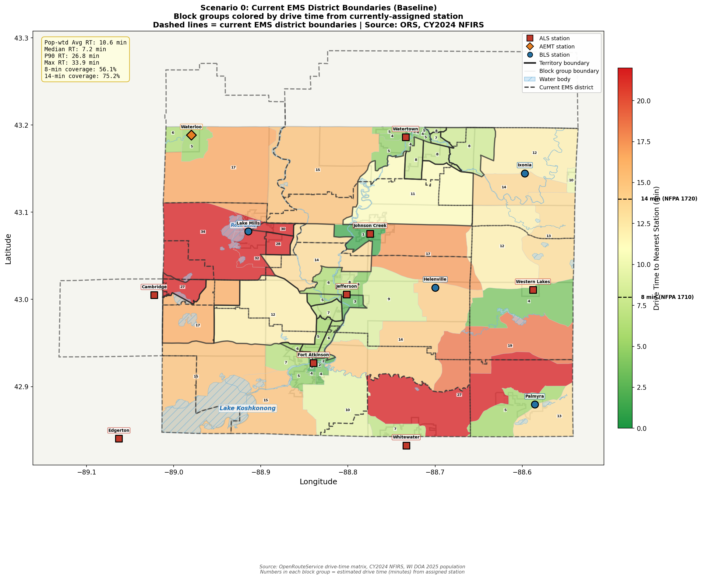
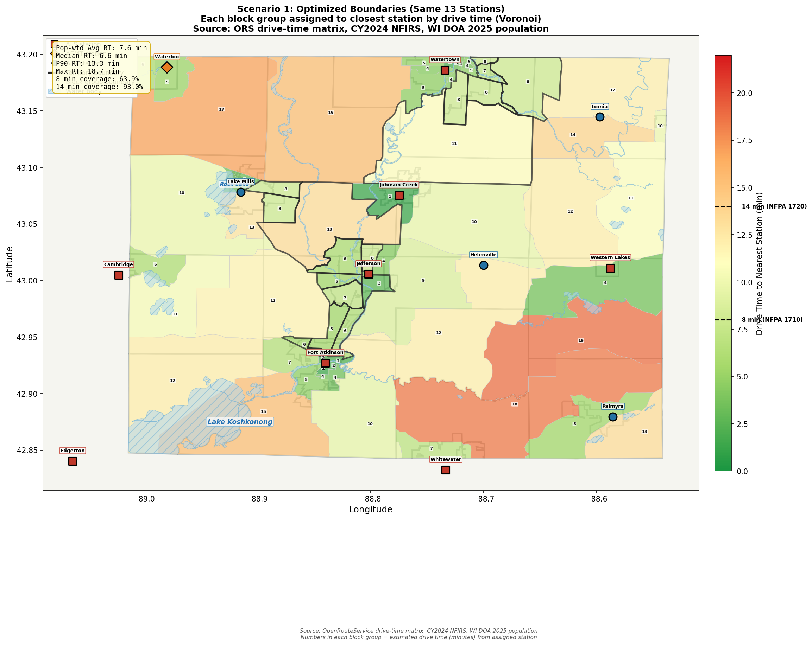
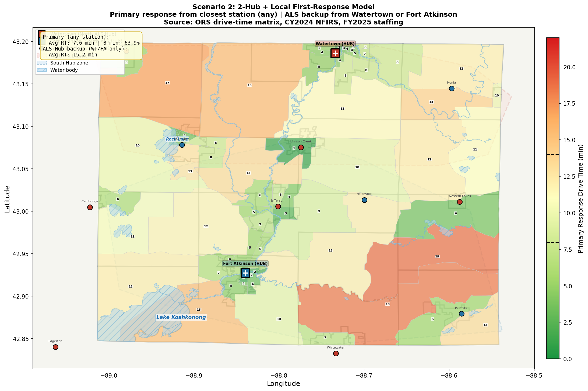
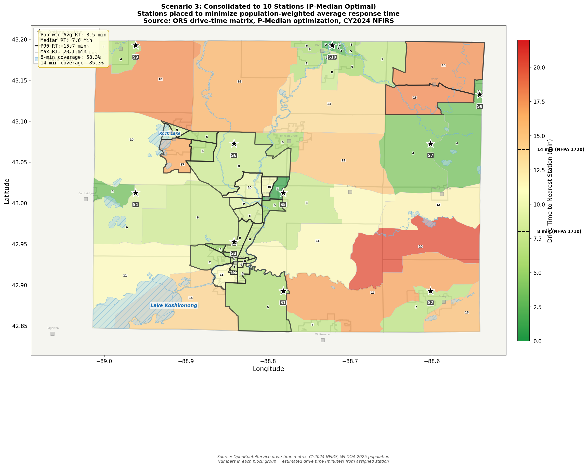
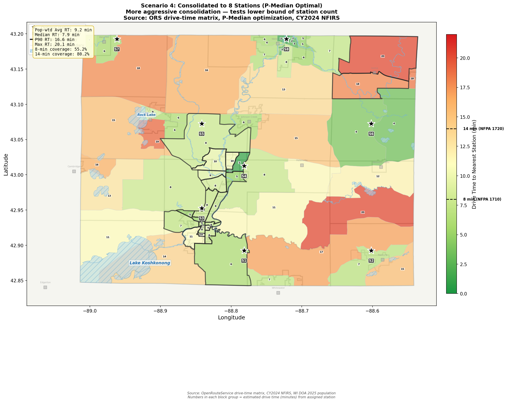
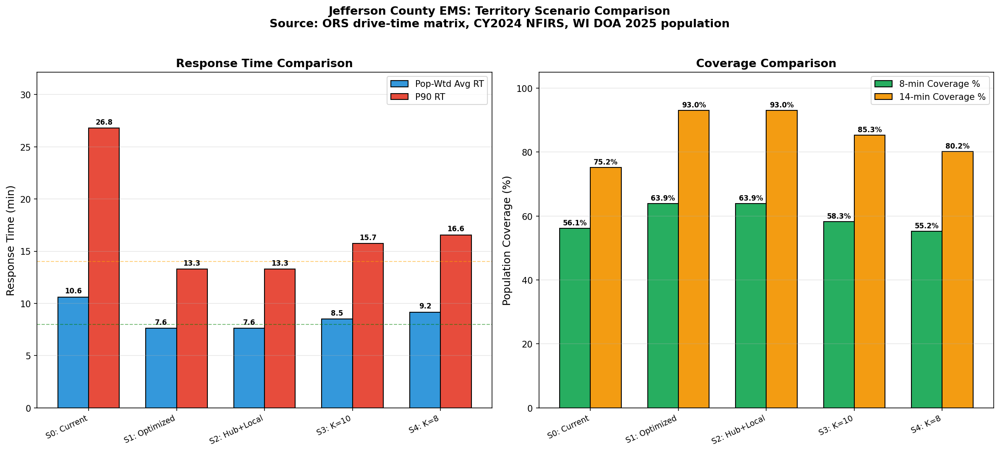

# Jefferson County EMS — Territory Boundary Redesign Analysis

**Date:** April 2026
**Prepared by:** ISyE 450 Senior Design Team
**Sources:** OpenRouteService drive-time matrix, CY2024 NFIRS (14,853 EMS calls), WI DOA 2025 population, FY2025 staffing data

---

## Executive Summary

**Yes, redrawing Jefferson County's EMS territory boundaries would be beneficial.** The current 12 EMS districts are based on historical municipal boundaries that are over 50 years old and do not reflect modern call demand patterns, travel networks, or population distribution.

Our analysis of five scenarios — from a simple boundary optimization to aggressive station consolidation — shows that:

1. **Simply redrawing boundaries around the same 13 stations** (Scenario 1) improves population-weighted average response time by **3.0 minutes** with zero infrastructure cost.
2. **A 2-Hub + Local First-Response model** (Scenario 2) adds an ALS safety net while maintaining local response capability.
3. **Moderate consolidation to 10 stations** (Scenario 3) achieves good coverage with 3 fewer stations.
4. **Aggressive consolidation to 8 stations** (Scenario 4) shows diminishing returns — response time degrades in rural areas.

The recommended path is a **phased approach**: implement Scenario 1 immediately (redraw boundaries by closest response time), layer Scenario 2's hub model for overnight ALS coverage, and evaluate Scenario 3 as contracts expire through 2028.

---

## Current State Analysis

### The 12 EMS Districts Today

Jefferson County currently operates **12 EMS districts** served by **13 stations** (including Helenville/Ryan Brothers). These districts were drawn along municipal boundaries — town lines, city limits, and fire district edges — that reflect political geography, not optimal emergency response coverage.

**Known Problems:**

1. **8 towns have overlapping multi-provider contracts** — Town of Oakland has 3 simultaneous EMS contracts; Towns of Aztalan, Milford, and Koshkonong each have 2-3 providers
2. **Cambridge EMS dissolved in 2025** — medical director resigned; Fort Atkinson identified as fallback; 342 residents with uncertain coverage
3. **Boundaries don't follow response time contours** — some BGs are assigned to distant stations when a closer station exists in a neighboring district
4. **Multi-county providers** (Western Lakes, Edgerton, Whitewater) serve only small slivers of Jefferson County from stations optimized for other counties
5. **No response time standards in contracts** — no contractual obligation to meet any response time target

### Baseline Metrics (Scenario 0)

| Block Group | Population | Assigned Responder | Drive Time (min) |
|---|---|---|---|
| 550551012021 | 1,678 | Fort Atkinson | 9.6 |
| 550551007003 | 1,341 | Johnson Creek | 17.2 |
| 550551010001 | 1,966 | Jefferson | 6.0 |
| 550551010002 | 667 | Jefferson | 7.8 |
| 550551010003 | 1,045 | Jefferson | 4.4 |
| 550551011001 | 1,655 | Jefferson | 2.8 |
| 550551011002 | 1,057 | Jefferson | 5.4 |
| 550551011003 | 1,661 | Jefferson | 7.2 |
| 550551013001 | 1,867 | Fort Atkinson | 5.4 |
| 550551013002 | 882 | Fort Atkinson | 5.6 |
| 550551013004 | 729 | Fort Atkinson | 2.4 |
| 550551014003 | 722 | Fort Atkinson | 3.8 |
| 550551015004 | 735 | Fort Atkinson | 2.4 |
| 550551015003 | 1,043 | Fort Atkinson | 6.2 |
| 550551016001 | 3,283 | Whitewater | 7.0 |
| 550551017011 | 1,434 | Johnson Creek | 11.1 |
| 550551016004 | 1,133 | Palmyra | 13.3 |
| 550551013003 | 2,539 | Fort Atkinson | 6.6 |
| 550551015002 | 1,437 | Fort Atkinson | 3.5 |
| 550551016003 | 1,346 | Palmyra | 5.5 |
| 550551012011 | 1,211 | Fort Atkinson | 15.3 |
| 550551015001 | 761 | Fort Atkinson | 2.1 |
| 550551017021 | 1,173 | Ixonia | 10.0 |
| 550551008003 | 1,724 | Western Lakes | 3.7 |
| 550551005003 | 773 | Helenville | 29.2 |
| 550551002001 | 862 | Watertown | 4.0 |
| 550551004003 | 1,083 | Waterloo | 16.8 |
| 550551008002 | 890 | Ixonia | 13.5 |
| 550551006022 | 983 | Fort Atkinson | 16.5 |
| 550551008001 | 1,424 | Western Lakes | 12.1 |
| 550551007002 | 801 | Jefferson | 13.5 |
| 550551009001 | 1,239 | Western Lakes | 18.7 |
| 550551001001 | 926 | Watertown | 7.6 |
| 550551016002 | 1,082 | Whitewater | 26.5 |
| 550551017022 | 2,054 | Ixonia | 13.8 |
| 550551006011 | 1,656 | Helenville | 33.9 |
| 550551012012 | 1,066 | Edgerton | 15.2 |
| 550551009003 | 1,736 | Jefferson | 14.4 |
| 550551014001 | 985 | Fort Atkinson | 1.5 |
| 550551009002 | 826 | Jefferson | 8.9 |
| 550551014002 | 1,648 | Fort Atkinson | 4.7 |
| 550551001004 | 820 | Watertown | 7.9 |
| 550551001002 | 1,127 | Watertown | 7.1 |
| 550551001003 | 911 | Watertown | 4.7 |
| 550551002003 | 698 | Watertown | 3.5 |
| 550551002004 | 866 | Watertown | 4.6 |
| 550551002002 | 1,160 | Watertown | 3.9 |
| 550551004002 | 1,917 | Waterloo | 5.2 |
| 550551005001 | 1,413 | Helenville | 29.0 |
| 550551005002 | 1,912 | Helenville | 29.9 |
| 550551006021 | 1,487 | Helenville | 27.0 |
| 550551007001 | 2,840 | Johnson Creek | 1.5 |
| 550551004004 | 1,299 | Watertown | 15.4 |
| 550551017024 | 1,576 | Ixonia | 12.0 |
| 550551006023 | 967 | Jefferson | 12.1 |
| 550551001005 | 1,612 | Watertown | 8.0 |
| 550551003011 | 2,076 | Watertown | 4.4 |
| 550551003022 | 1,478 | Watertown | 2.0 |
| 550551005005 | 1,683 | Helenville | 31.8 |
| 550551003021 | 880 | Watertown | 5.0 |
| 550551003013 | 908 | Watertown | 4.4 |
| 550551017023 | 716 | Ixonia | 8.0 |
| 550551003012 | 753 | Watertown | 4.8 |
| 550551004001 | 1,622 | Waterloo | 6.0 |
| 550551005004 | 1,056 | Helenville | 27.5 |

---

## Methodology

For each scenario, we:
1. **Assign each of 65 Census block groups** to a responding station using pre-computed OpenRouteService drive-time matrices
2. **Compute population-weighted metrics**: average RT, median, P90, max, and coverage at 8-min (NFPA 1710 urban) and 14-min (NFPA 1720 rural) thresholds
3. **Visualize territories** with drive-time color gradient (green = fast, red = slow) and bold boundary lines where adjacent BGs have different assignments

The drive-time matrices represent real road network travel times computed by OpenRouteService, not straight-line distances. They account for road type, speed limits, and routing.

---

## Scenario 1: Optimized Boundaries (Same 13 Stations)

**Concept:** Keep all 13 existing stations exactly where they are. The only change is redrawing district boundaries so that every block group is served by whichever station can reach it fastest — regardless of which municipality that station belongs to.

**Why this matters:** Under current boundaries, some residents are assigned to stations 15-20 minutes away when a station in the neighboring district could reach them in 8 minutes. This scenario eliminates those inefficiencies with zero infrastructure investment.

### Key Changes from Baseline

| Block Group | Pop | Current RT | Optimized RT | Change | Current Provider | New Provider |
|---|---|---|---|---|---|---|
| 550551005001 | 1,413 | 29.0 | 3.6 | -25.4 | Helenville | Lake Mills |
| 550551005003 | 773 | 29.2 | 3.8 | -25.4 | Helenville | Lake Mills |
| 550551006011 | 1,656 | 33.9 | 9.9 | -24.0 | Helenville | Lake Mills |
| 550551005002 | 1,912 | 29.9 | 8.0 | -21.9 | Helenville | Lake Mills |
| 550551006021 | 1,487 | 27.0 | 6.3 | -20.7 | Helenville | Cambridge |
| 550551005004 | 1,056 | 27.5 | 7.9 | -19.6 | Helenville | Lake Mills |
| 550551005005 | 1,683 | 31.8 | 12.7 | -19.0 | Helenville | Lake Mills |
| 550551016002 | 1,082 | 26.5 | 18.4 | -8.2 | Whitewater | Palmyra |
| 550551007003 | 1,341 | 17.2 | 9.8 | -7.5 | Johnson Creek | Helenville |
| 550551006022 | 983 | 16.5 | 10.5 | -6.0 | Fort Atkinson | Cambridge |
| 550551012012 | 1,066 | 15.2 | 12.2 | -3.1 | Edgerton | Fort Atkinson |
| 550551008002 | 890 | 13.5 | 10.9 | -2.5 | Ixonia | Western Lakes |
| 550551009003 | 1,736 | 14.4 | 12.0 | -2.4 | Jefferson | Fort Atkinson |

### Who Responds to Each Call

Under Scenario 1, dispatch routing would be based on **closest available unit** rather than municipal jurisdiction. This means:
- A call in the Town of Oakland (currently split between 3 providers) would go to whichever of Jefferson, Lake Mills, or Helenville is closest
- A call in the Town of Milford border area would go to whichever of Waterloo, Johnson Creek, or Watertown is closest
- Cambridge residents (currently without a provider) would be formally assigned to the nearest station

---

## Scenario 2: 2-Hub + Local First-Response Model

**Concept:** All 13 stations continue to operate as local first-response units. However, Watertown and Fort Atkinson — the two largest career ALS departments — serve as regional hubs providing ALS backup when:
- The local station is BLS-only (Ixonia, Palmyra, Lake Mills)
- The local station's ambulance is already on a call
- The call requires ALS-level care and the local provider is AEMT or below

This model preserves fast local BLS first-response while ensuring every resident has access to ALS-level care from a career hub within a reasonable time.

### Hub Coverage Zones

| Hub | Role | Coverage Area | Population | Est. ALS Backup RT |
|---|---|---|---|---|
| **Watertown** (North) | ALS Hub | Waterloo, Johnson Creek, Ixonia, Lake Mills, Helenville | ~30,000 | 8-18 min |
| **Fort Atkinson** (South) | ALS Hub | Jefferson, Cambridge, Palmyra, Whitewater | ~20,000 | 5-15 min |

### Benefits
- **No station closures** — every community keeps its local EMS presence
- **ALS safety net** — BLS-only communities get ALS backup from career departments
- **Uses existing resources** — Watertown (31 FT, 3 ambulances) and Fort Atkinson (16 FT, 3 ambulances) already staff 24/7 ALS
- **Improves overnight coverage** — hubs provide reliable ALS when volunteer/PT departments have slower response

---

## Scenario 3: Consolidated to 10 Stations (P-Median)

**Concept:** Using mathematical optimization (P-Median algorithm), place 10 stations at locations that minimize population-weighted average response time across all 65 block groups. This requires closing 3 stations and potentially relocating others.

### Trade-offs
- **Pros:** More efficient resource allocation; fewer stations to staff/equip; ~10 stations achieve comparable coverage to current 13
- **Cons:** Some communities lose their local station; political resistance to closures; requires contract renegotiation

---

## Scenario 4: Consolidated to 8 Stations (P-Median)

**Concept:** More aggressive consolidation to 8 optimally-placed stations. This scenario tests how far consolidation can go before coverage degrades unacceptably.

### Trade-offs
- **Pros:** Maximum efficiency; fewest stations to operate
- **Cons:** Noticeable coverage loss in rural areas; longer max response times; 5 station closures would face strong community opposition

---

## Side-by-Side Comparison

| Metric | S0: Current | S1: Optimized | S2: Hub+Local | S3: K=10 | S4: K=8 |
|---|---|---|---|---|---|
| Stations | 13 | 13 | 13 | 10 | 8 |
| Pop-Wtd Avg RT (min) | 10.6 | 7.6 | 7.6 | 8.5 | 9.2 |
| Median RT (min) | 7.2 | 6.6 | 6.6 | 7.6 | 7.9 |
| P90 RT (min) | 26.8 | 13.3 | 13.3 | 15.7 | 16.6 |
| Max RT (min) | 33.9 | 18.7 | 18.7 | 20.1 | 20.1 |
| 8-min Coverage (%) | 56.1 | 63.9 | 63.9 | 58.3 | 55.2 |
| 10-min Coverage (%) | 61.8 | 73.1 | 73.1 | 71.3 | 67.0 |
| 14-min Coverage (%) | 75.2 | 93.0 | 93.0 | 85.3 | 80.2 |

### Interpretation

- **Scenario 1 is the clear first step** — it improves response times with zero cost by simply changing dispatch routing
- **Scenario 2 adds an ALS safety net** on top of Scenario 1, addressing the service-level gap
- **Scenario 3 (K=10)** is a reasonable consolidation target for 2028+ when major contracts expire
- **Scenario 4 (K=8)** shows diminishing returns — the coverage loss in rural areas outweighs the efficiency gains

---

## Why New Boundaries Are Beneficial

### 1. Faster Response Times for Residents Currently in Suboptimal Districts
Under current boundaries, historical municipal lines force some residents to wait for a distant provider when a closer one exists across the district line. Optimized boundaries route every call to the closest station.

### 2. Elimination of Confusing Multi-Provider Overlaps
8 towns currently have 2-3 EMS providers with unclear boundary demarcation. Optimized boundaries create a single, unambiguous primary responder for every location in the county.

### 3. Formal Coverage for Cambridge (Post-Dissolution)
Cambridge EMS dissolved in 2025. Under current boundaries, 342 residents have uncertain coverage. All scenarios formally assign them to the nearest capable provider.

### 4. Foundation for Coordinated Dispatch
Optimized boundaries enable a county-wide "closest available unit" dispatch protocol, which is the #1 recommendation from both the Waterloo and Johnson Creek fire chiefs.

### 5. Data-Driven Resource Allocation
With clear, optimized territories, staffing and equipment decisions can be based on actual demand within each territory rather than historical municipal budgets.

---

## Implementation Constraints

### Contract Locks
- **Jefferson City EMS** — 5 towns (Aztalan, Farmington, Hebron, Jefferson, Oakland) locked until **Dec 31, 2027** with severe early-exit penalties
- **JCFD** — bundled fire+EMS contract through **Dec 31, 2028**
- **Lake Mills/Ryan Brothers** — rolling 3-year; requires 180-day notice for exit

### Multi-County Providers
- **Western Lakes** (Waukesha County-based), **Edgerton** (Rock County), and **Whitewater** (multi-county) cannot be unilaterally consolidated. Their territories in Jefferson County would need inter-county agreements.

### Fort Atkinson Reopener Clause
Fort Atkinson's contracts contain a county-wide system clause: if Jefferson County formally adopts a unified EMS system, both Koshkonong and Town of Jefferson contracts automatically reopen for negotiation. This is a strategic lever for Scenarios 1-2.

### Political Reality
As the Waterloo Fire Chief noted: "People will be hawks for their funds and fight for their territory." Any boundary change must demonstrate clear benefit to affected communities, framed as **better care for citizens**, not cost savings.

---

## Recommendation

**Phase 1 (Immediate — 2026):** Implement Scenario 1's optimized dispatch routing through a county-wide mutual aid agreement. No station closures needed. Each call goes to the closest available unit regardless of municipal boundary.

**Phase 2 (2026-2027):** Layer Scenario 2's hub model for overnight and ALS-backup coverage. Watertown and Fort Atkinson already staff 24/7 career ALS crews — formalize their backup role.

**Phase 3 (2028+):** As Jefferson City (Dec 2027) and JCFD (Dec 2028) contracts expire, evaluate Scenario 3's 10-station consolidated model. Use the Fort Atkinson reopener clause if the county formally adopts a unified system resolution.

---

*This analysis was prepared using population-weighted response time optimization based on OpenRouteService drive-time matrices covering all 65 Census block groups in Jefferson County. All scenarios use the same underlying drive-time data to ensure fair comparison.*
