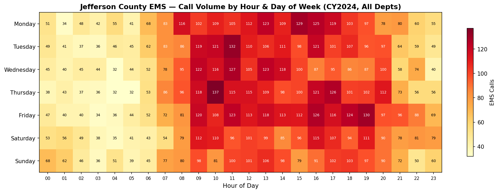
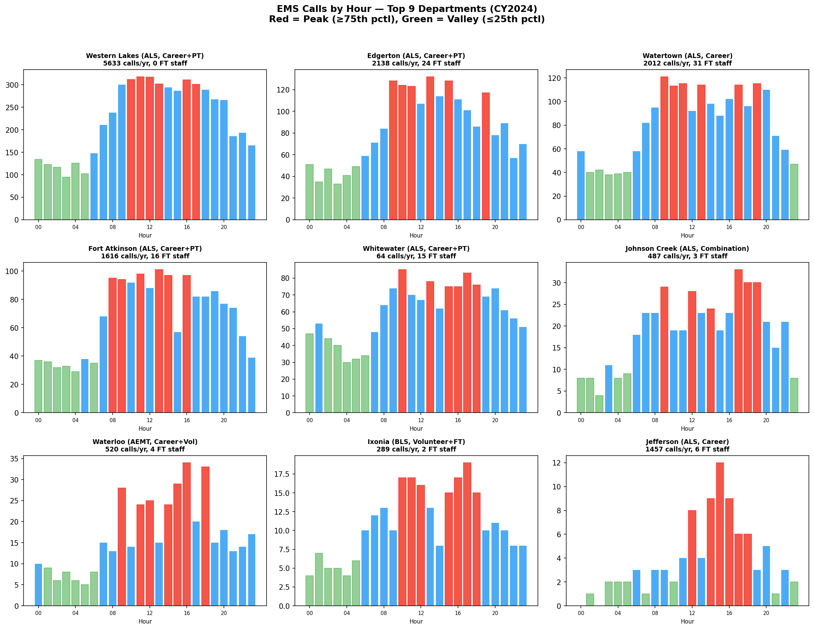
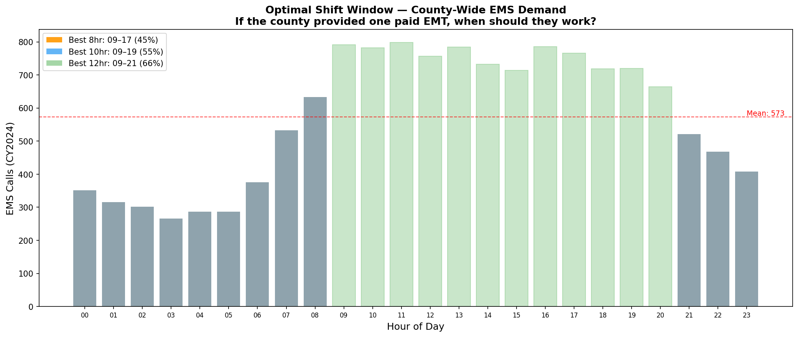
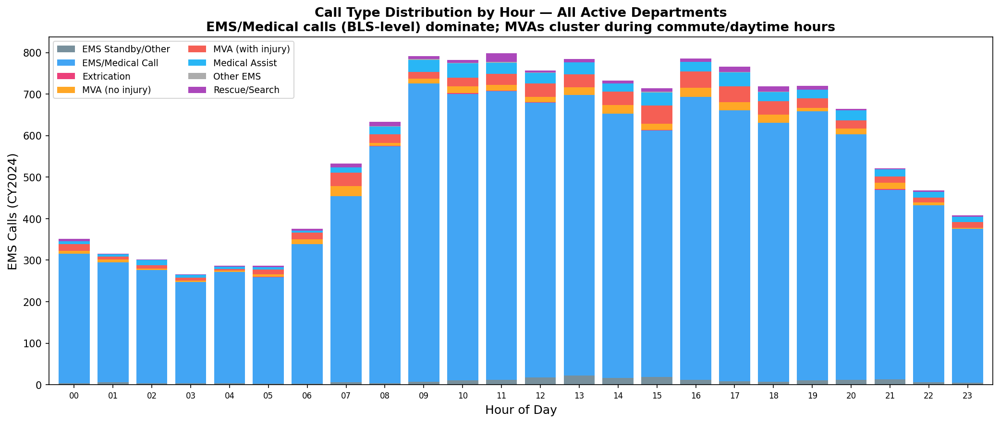
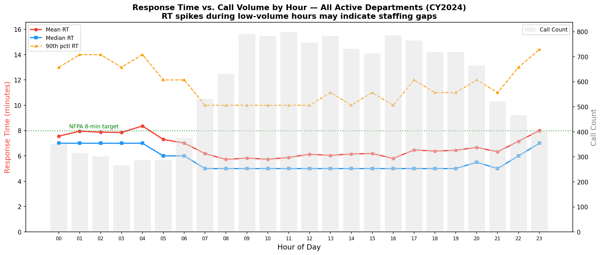
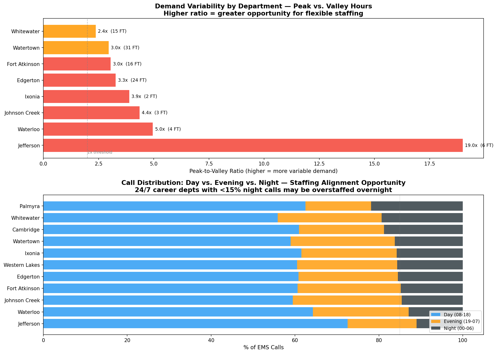

# Peak Staffing Requirements Analysis — Jefferson County EMS

**Goal 2: Investigate Peak Staffing Requirements**
*Analysis Date: March 25, 2026 | Data: CY2024 NFIRS (14 departments, 13,758 EMS calls)*

---

## Executive Summary

Jefferson County's EMS call demand follows a pronounced **daytime peak / nighttime valley** pattern. County-wide, **60% of calls occur between 08:00–18:00** while only **16% occur between 00:00–06:59**. The single busiest hour is **11:00** (798 calls/year), while the quietest is **03:00** (266 calls/year) — a **3.0x** difference.

This mismatch between constant 24/7 staffing and highly variable demand represents the core finding: **staffing is uniform but demand is not**.

---

## 1. County-Wide Temporal Demand Profile

### Hour-of-Day Pattern
| Metric | Value |
|--------|-------|
| Peak hour | **11:00** (798 calls, 5.8% of annual) |
| Valley hour | **03:00** (266 calls, 1.9% of annual) |
| Peak-to-valley ratio | **3.0x** |
| Best 4-hr block | **09:00–13:00** (3128 calls, 23% of annual) |
| Best 8-hr shift | **09:00–17:00** (6144 calls, 45%) |
| Best 10-hr shift | **09:00–19:00** (7628 calls, 55%) |
| Best 12-hr shift | **09:00–21:00** (9012 calls, 66%) |

### Day-of-Week Pattern
| Day | Calls | % of Weekly |
|-----|-------|------------|
| Monday | 2,044 | 14.9% |
| Tuesday | 1,976 | 14.4% |
| Wednesday | 1,913 | 13.9% |
| Thursday | 1,992 | 14.5% |
| Friday | 2,099 | 15.3% **← Peak** |
| Saturday | 1,902 | 13.8% |
| Sunday | 1,832 | 13.3% **← Low** |

**Key finding**: Day-of-week variation is modest (1.15x range). The dominant pattern is **hourly**, not daily — staffing optimization should focus on time-of-day shifts rather than day-of-week scheduling.

### Time Block Summary
| Time Block | Hours | Calls | % of Total | Avg Calls/Hr |
|-----------|-------|-------|-----------|-------------|
| Night (00:00–06:59) | 7 hrs | 2,183 | 15.9% | 312 |
| Morning (07:00–11:59) | 5 hrs | 3,537 | 25.7% | 707 |
| Afternoon (12:00–17:59) | 6 hrs | 4,539 | 33.0% | 756 |
| Evening (18:00–23:59) | 6 hrs | 3,499 | 25.4% | 583 |

---

## 2. Per-Department Demand Profiles

### Western Lakes
- **Service level**: ALS | **Model**: Career+PT | **FT staff**: 0 | **PT staff**: 0
- **Authoritative call volume**: 5,633/yr (15.4/day)
- **Peak hours**: 10:00, 11:00, 12:00, 16:00 (23.3% of calls)
- **Valley hours**: 01:00, 02:00, 03:00, 05:00 (8.1% of calls)
- **Peak-to-valley ratio**: 2.88x
- **Day (08-18) share**: 61% | **Night (00-06) share**: 16%

### Edgerton
- **Service level**: ALS | **Model**: Career+PT | **FT staff**: 24 | **PT staff**: 0
- **Authoritative call volume**: 2,138/yr (5.9/day)
- **Peak hours**: 09:00, 10:00, 13:00, 15:00 (25.2% of calls)
- **Valley hours**: 01:00, 02:00, 03:00, 04:00 (7.7% of calls)
- **Peak-to-valley ratio**: 3.28x
- **Day (08-18) share**: 61% | **Night (00-06) share**: 15%

### Watertown
- **Service level**: ALS | **Model**: Career | **FT staff**: 31 | **PT staff**: 3
- **Authoritative call volume**: 2,012/yr (5.5/day)
- **Peak hours**: 09:00, 11:00, 13:00, 19:00 (23.9% of calls)
- **Valley hours**: 01:00, 03:00, 04:00, 05:00 (8.1% of calls)
- **Peak-to-valley ratio**: 2.96x
- **Day (08-18) share**: 59% | **Night (00-06) share**: 16%

### Fort Atkinson
- **Service level**: ALS | **Model**: Career+PT | **FT staff**: 16 | **PT staff**: 28
- **Authoritative call volume**: 1,616/yr (4.4/day)
- **Peak hours**: 11:00, 13:00, 14:00, 16:00 (24.2% of calls)
- **Valley hours**: 02:00, 03:00, 04:00, 06:00 (8.0% of calls)
- **Peak-to-valley ratio**: 3.05x
- **Day (08-18) share**: 61% | **Night (00-06) share**: 15%

### Jefferson
- **Service level**: ALS | **Model**: Career | **FT staff**: 6 | **PT staff**: 20
- **Authoritative call volume**: 1,457/yr (4.0/day)
- **Peak hours**: 12:00, 14:00, 15:00, 16:00 (41.8% of calls)
- **Valley hours**: 00:00, 01:00, 02:00, 07:00 (2.2% of calls)
- **Peak-to-valley ratio**: 19.0x
- **Day (08-18) share**: 73% | **Night (00-06) share**: 11%

### Waterloo
- **Service level**: AEMT | **Model**: Career+Vol | **FT staff**: 4 | **PT staff**: 22
- **Authoritative call volume**: 520/yr (1.4/day)
- **Peak hours**: 09:00, 15:00, 16:00, 18:00 (30.8% of calls)
- **Valley hours**: 02:00, 03:00, 04:00, 05:00 (6.2% of calls)
- **Peak-to-valley ratio**: 4.96x
- **Day (08-18) share**: 64% | **Night (00-06) share**: 13%

### Johnson Creek
- **Service level**: ALS | **Model**: Combination | **FT staff**: 3 | **PT staff**: 33
- **Authoritative call volume**: 487/yr (1.3/day)
- **Peak hours**: 09:00, 17:00, 18:00, 19:00 (26.9% of calls)
- **Valley hours**: 00:00, 01:00, 02:00, 04:00 (6.2% of calls)
- **Peak-to-valley ratio**: 4.36x
- **Day (08-18) share**: 59% | **Night (00-06) share**: 15%

### Ixonia
- **Service level**: BLS | **Model**: Volunteer+FT | **FT staff**: 2 | **PT staff**: 45
- **Authoritative call volume**: 289/yr (0.8/day)
- **Peak hours**: 10:00, 11:00, 16:00, 17:00 (26.9% of calls)
- **Valley hours**: 00:00, 02:00, 03:00, 04:00 (6.9% of calls)
- **Peak-to-valley ratio**: 3.89x
- **Day (08-18) share**: 62% | **Night (00-06) share**: 16%

### Cambridge
- **Service level**: ALS | **Model**: Volunteer | **FT staff**: 0 | **PT staff**: 31
- **Authoritative call volume**: 87/yr (0.2/day)
- **Peak hours**: 08:00, 11:00, 12:00, 16:00 (32.8% of calls)
- **Valley hours**: 00:00, 03:00, 06:00, 23:00 (4.7% of calls)
- **Peak-to-valley ratio**: 7.0x
- **Day (08-18) share**: 61% | **Night (00-06) share**: 19%

### Whitewater
- **Service level**: ALS | **Model**: Career+PT | **FT staff**: 15 | **PT staff**: 17
- **Authoritative call volume**: 64/yr (0.2/day)
- **Peak hours**: 10:00, 13:00, 17:00, 18:00 (22.2% of calls)
- **Valley hours**: 03:00, 04:00, 05:00, 06:00 (9.4% of calls)
- **Peak-to-valley ratio**: 2.37x
- **Day (08-18) share**: 56% | **Night (00-06) share**: 19%

### Palmyra
- **Service level**: BLS | **Model**: Volunteer | **FT staff**: 0 | **PT staff**: 20
- **Authoritative call volume**: 32/yr (0.1/day)
- **Peak hours**: 01:00, 11:00, 12:00, 19:00 (40.6% of calls)
- **Valley hours**: 03:00, 04:00, 08:00, 09:00 (0.0% of calls)
- **Peak-to-valley ratio**: infx
- **Day (08-18) share**: 62% | **Night (00-06) share**: 22%

---

## 3. Optimal Shift Window — County-Provided EMT/Paramedic

If Jefferson County were to fund **one paid EMT or paramedic** to supplement existing municipal EMS, the data shows:

| Shift Length | Optimal Window | Calls Covered | % of Annual |
|-------------|---------------|--------------|-------------|
| 8 hours | **09:00 – 17:00** | 6,144 | 45% |
| 10 hours | **09:00 – 19:00** | 7,628 | 55% |
| 12 hours | **09:00 – 21:00** | 9,012 | 66% |

### Staffing Level Recommendation by Call Type

The call type breakdown by hour shows:
- **EMS/Medical Call**: 12,118 calls (88%)
- **MVA (with injury)**: 519 calls (4%)
- **Medical Assist**: 440 calls (3%)
- **MVA (no injury)**: 288 calls (2%)
- **EMS Standby/Other**: 211 calls (2%)
- **Rescue/Search**: 157 calls (1%)
- **Other EMS**: 14 calls (0%)
- **Extrication**: 11 calls (0%)

**Implication**: EMS/Medical calls and medical assists (93% of calls combined) are predominantly BLS-level and dominate at all hours. An **EMT-Basic** can handle the vast majority of peak-hour demand. MVA calls (6% of calls) cluster during commute and daytime hours (07:00-09:00, 15:00-18:00) and are more likely to require ALS-level care.

**Recommended staffing level for county-provided position**:
- If **one position**: Paramedic (ALS) -- covers both routine medical calls and the higher-acuity MVA peak
- If **cost-constrained**: EMT-Basic with ALS intercept protocol -- handles ~93% of calls independently

---

## 4. Response Time by Hour — Understaffing Signals

Response times that spike during specific hours suggest inadequate staffing coverage during those windows.

| Metric | Value |
|--------|-------|
| Worst mean RT hour | **04:00** (8.4 min) |
| Best mean RT hour | **08:00** (5.7 min) |
| Overall mean RT | 6.5 min |
| Overall median RT | 5.0 min |

### Per-Department Night vs. Day Response Time

| Department | Overall RT | Day RT (08-18) | Night RT (00-06) | Night-Day Delta | Signal |
|-----------|-----------|---------------|-----------------|----------------|--------|
| Ixonia | 11.2 | 8.9 | 15.3 | +6.4 min | **Significant night degradation** |
| Palmyra | 7.2 | 5.5 | 11.0 | +5.5 min | **Significant night degradation** |
| Waterloo | 8.0 | 6.2 | 10.6 | +4.4 min | **Significant night degradation** |
| Johnson Creek | 7.9 | 6.7 | 9.7 | +3.0 min | Moderate night increase |
| Whitewater | 5.8 | 5.2 | 7.0 | +1.8 min | Moderate night increase |
| Edgerton | 7.2 | 6.5 | 8.3 | +1.8 min | Moderate night increase |
| Jefferson | 7.7 | 6.4 | 7.9 | +1.5 min | Moderate night increase |
| Watertown | 6.1 | 5.6 | 7.1 | +1.5 min | Moderate night increase |
| Western Lakes | 7.2 | 6.5 | 7.9 | +1.4 min | Moderate night increase |
| Fort Atkinson | 4.7 | 4.2 | 5.3 | +1.1 min | Moderate night increase |
| Cambridge | 7.7 | 7.6 | 7.9 | +0.3 min | Stable |

---

## 5. Overstaffing Analysis — Where Resources Can Be Reduced

### Departments with Highest Demand Variability

Departments with **constant 24/7 career staffing** but **highly variable demand** represent the greatest mismatch. A peak-to-valley ratio above 2.0x means peak hours see more than double the calls of valley hours, yet staffing levels remain the same.

#### Jefferson (Peak-Valley Ratio: 19.0x)
- **6 FT staff** provide 24/7 coverage, but **11% of calls occur overnight (00-06)**
- Peak demand at 12:00, 14:00, 15:00, 16:00 receives the same staffing as valley hours
- **Diagnostic**: With 4.0 calls/day average, overnight hours average ~0.05 calls/hr — well below the daily average of 0.12 calls/hr
#### Waterloo (Peak-Valley Ratio: 4.96x)
- **4 FT staff** provide 24/7 coverage, but **13% of calls occur overnight (00-06)**
- Peak demand at 09:00, 15:00, 16:00, 18:00 receives the same staffing as valley hours
- **Diagnostic**: With 1.4 calls/day average, overnight hours average ~0.24 calls/hr — well below the daily average of 0.55 calls/hr
#### Johnson Creek (Peak-Valley Ratio: 4.36x)
- **3 FT staff** provide 24/7 coverage, but **15% of calls occur overnight (00-06)**
- Peak demand at 09:00, 17:00, 18:00, 19:00 receives the same staffing as valley hours
- **Diagnostic**: With 1.3 calls/day average, overnight hours average ~0.31 calls/hr — well below the daily average of 0.62 calls/hr
#### Ixonia (Peak-Valley Ratio: 3.89x)
- **2 FT staff** provide 24/7 coverage, but **16% of calls occur overnight (00-06)**
- Peak demand at 10:00, 11:00, 16:00, 17:00 receives the same staffing as valley hours
- **Diagnostic**: With 0.8 calls/day average, overnight hours average ~0.19 calls/hr — well below the daily average of 0.36 calls/hr
#### Edgerton (Peak-Valley Ratio: 3.28x)
- **24 FT staff** provide 24/7 coverage, but **15% of calls occur overnight (00-06)**
- Peak demand at 09:00, 10:00, 13:00, 15:00 receives the same staffing as valley hours
- **Diagnostic**: With 5.9 calls/day average, overnight hours average ~1.48 calls/hr — well below the daily average of 2.79 calls/hr
#### Fort Atkinson (Peak-Valley Ratio: 3.05x)
- **16 FT staff** provide 24/7 coverage, but **15% of calls occur overnight (00-06)**
- Peak demand at 11:00, 13:00, 14:00, 16:00 receives the same staffing as valley hours
- **Diagnostic**: With 4.4 calls/day average, overnight hours average ~1.13 calls/hr — well below the daily average of 2.22 calls/hr
#### Watertown (Peak-Valley Ratio: 2.96x)
- **31 FT staff** provide 24/7 coverage, but **16% of calls occur overnight (00-06)**
- Peak demand at 09:00, 11:00, 13:00, 19:00 receives the same staffing as valley hours
- **Diagnostic**: With 5.5 calls/day average, overnight hours average ~1.48 calls/hr — well below the daily average of 2.67 calls/hr
#### Whitewater (Peak-Valley Ratio: 2.37x)
- **15 FT staff** provide 24/7 coverage, but **19% of calls occur overnight (00-06)**
- Peak demand at 10:00, 13:00, 17:00, 18:00 receives the same staffing as valley hours
- **Diagnostic**: With 0.2 calls/day average, overnight hours average ~1.32 calls/hr — well below the daily average of 1.98 calls/hr

### Night Staffing Diagnostic

For departments operating 24/7 career staffing, the overnight period (00:00–06:59) typically accounts for the lowest call volume. The question is: **does the current overnight staffing level match the actual demand?**

| Department | Night Calls (00-06) | Night % | Calls/Night-Hour | FT Staff | 24/7 Model? |
|-----------|-------------------|---------|-----------------|----------|------------|
| Western Lakes | 845 | 16% | 121/yr | 0 | Yes |
| Edgerton | 315 | 15% | 45/yr | 24 | Yes |
| Watertown | 315 | 16% | 45/yr | 31 | Yes |
| Fort Atkinson | 240 | 15% | 34/yr | 16 | Yes |
| Jefferson | 10 | 11% | 1/yr | 6 | Yes |
| Waterloo | 52 | 13% | 7/yr | 4 | No |
| Johnson Creek | 66 | 15% | 9/yr | 3 | No |
| Ixonia | 41 | 16% | 6/yr | 2 | No |
| Cambridge | 12 | 19% | 2/yr | 0 | No |
| Whitewater | 280 | 19% | 40/yr | 15 | Yes |
| Palmyra | 7 | 22% | 1/yr | 0 | No |

---

## 6. Staffing Recommendations Summary

### Key Findings

1. **Demand is heavily time-dependent**: The county sees a 3.0x difference between peak and valley hours. This is the single largest staffing efficiency lever.

2. **Overnight staffing mismatch**: Departments with 24/7 career models (Watertown, Fort Atkinson, Whitewater, Jefferson) maintain full overnight shifts despite 16% of calls occurring 00:00–06:59. This is not inherently wrong (response time matters more than volume at night), but it does mean resources are underutilized during these hours.

3. **Optimal county EMT window**: A single county-provided EMT working **09:00–17:00** would cover **45% of county-wide EMS calls**, maximizing impact per labor dollar.

4. **Call type is uniform**: BLS-level calls (EMS/Medical + Medical Assist) account for ~93% of all calls at all hours. ALS is most needed during commute-hour MVA peaks (6% of calls).

5. **Day-of-week variation is minimal**: Unlike hour-of-day (3.0x variation), day-of-week varies only ~1.1x. Weekday vs. weekend scheduling changes would have low impact.

### Where to Reduce Staffing
- **Overnight (00:00–06:00)** in career departments with low night call volumes
- **Departments with <2 calls/day** may not need dedicated 24/7 EMS coverage at all — mutual aid or regional roving units could serve these areas during off-peak hours

### Where to Increase Staffing
- **11:00–15:00 window** is consistently the highest-demand period across all departments
- Volunteer departments during **daytime weekday hours** when volunteers are at their day jobs and unavailable

---

## Data Sources & Methodology

- **Call data**: 14 NFIRS Excel files, CY2024 (Calendar Year). EMS calls only (Rescue and EMS category 300-381).
- **Staffing data**: FY2025 budget documents + fire chief interviews (Mar 2026). See `staffing_sources.md` for per-department sources.
- **Authoritative call volumes**: User-provided ground-truth counts (14,853 total). Used for rates and ratios; NFIRS temporal patterns used for hourly/daily distributions.
- **Response times**: NFIRS "Response Time (Minutes)" field, filtered 0–60 min to remove outliers.
- **Partial-year adjustments**: Palmyra (3 months → ×4.0), Helenville (7 months → ×1.714). Helenville excluded from analysis due to minimal EMS data.

*Note: This analysis is diagnostic. It identifies where staffing and demand are misaligned, not what specific changes to make. Specific scheduling recommendations require additional input on minimum coverage requirements, union contracts, response time targets, and mutual aid agreements.*
