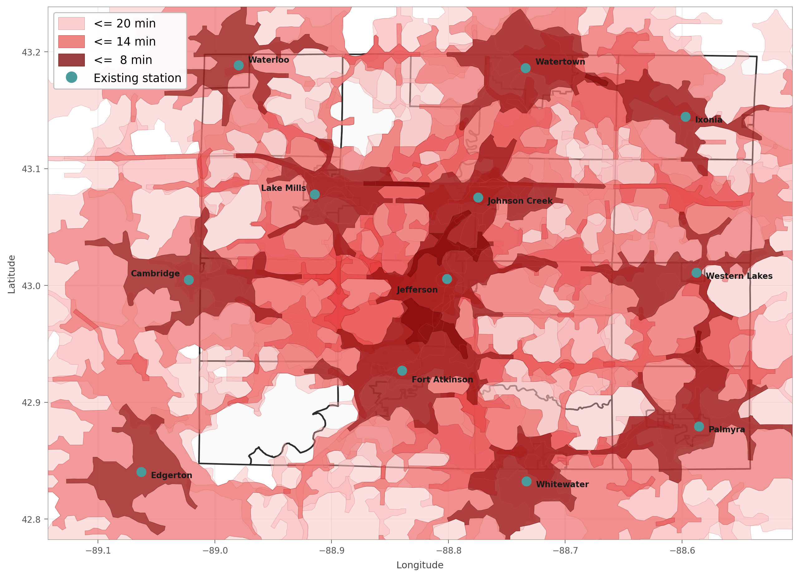
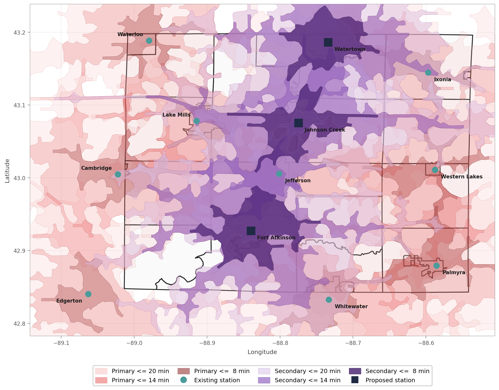
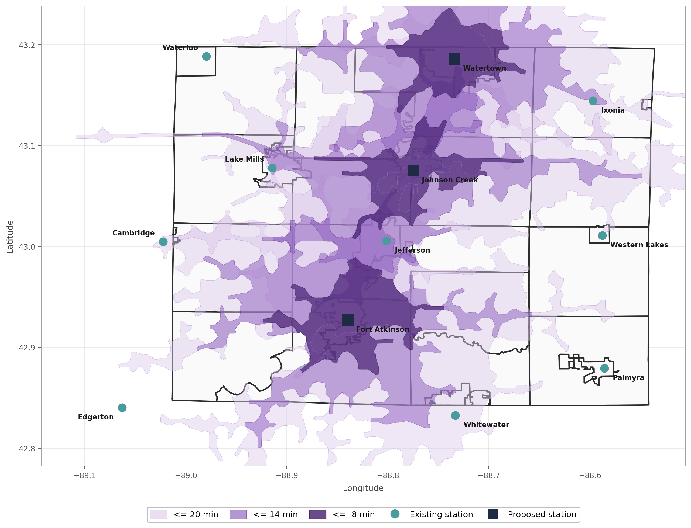
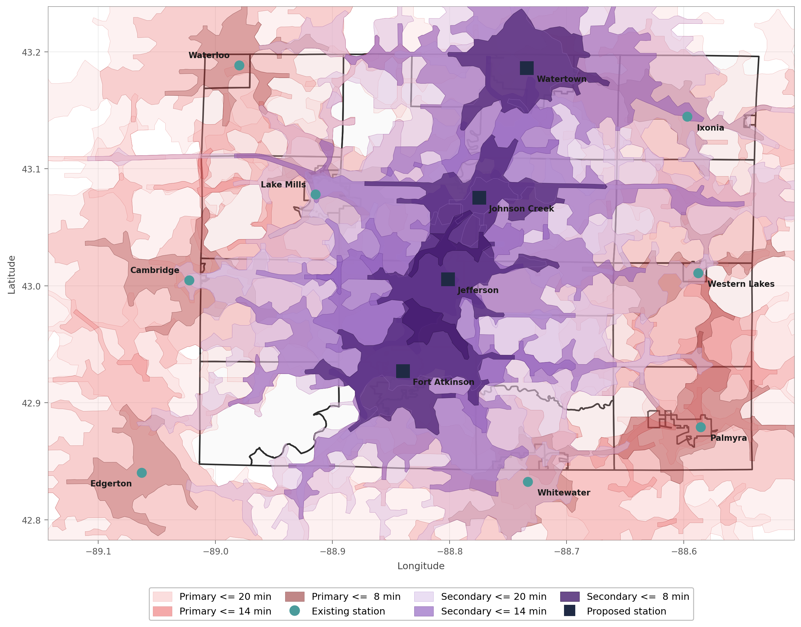
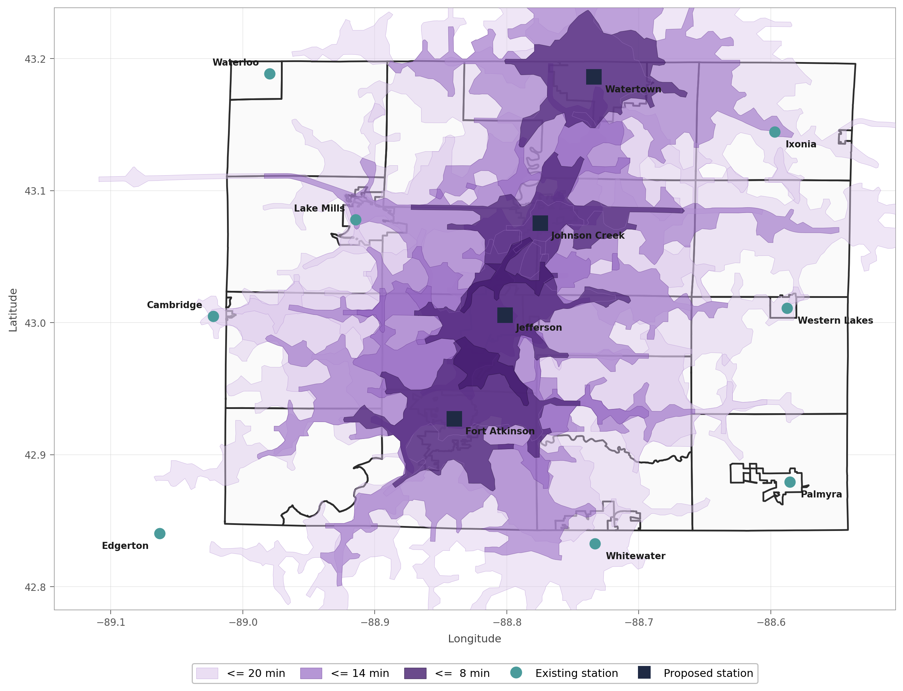
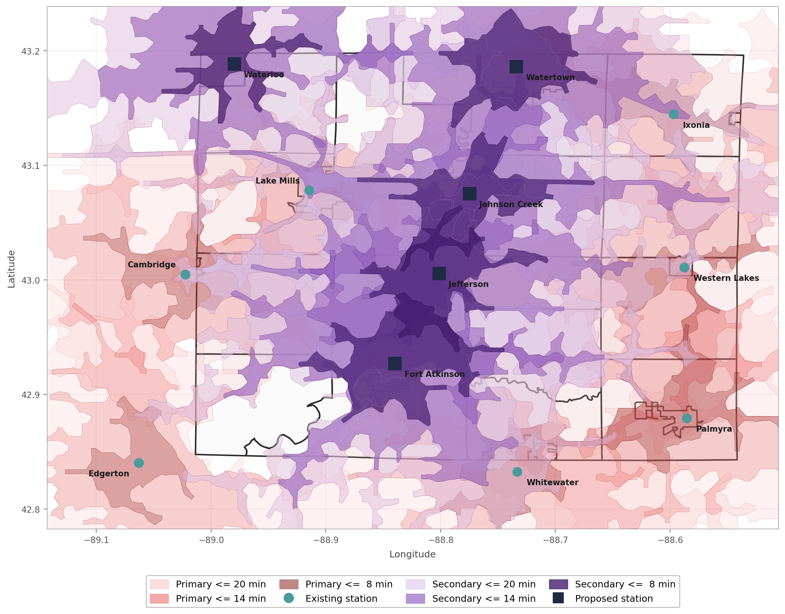
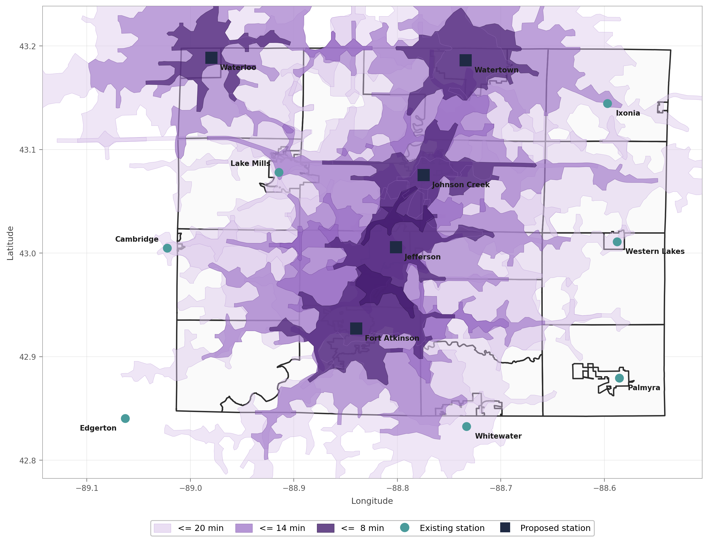
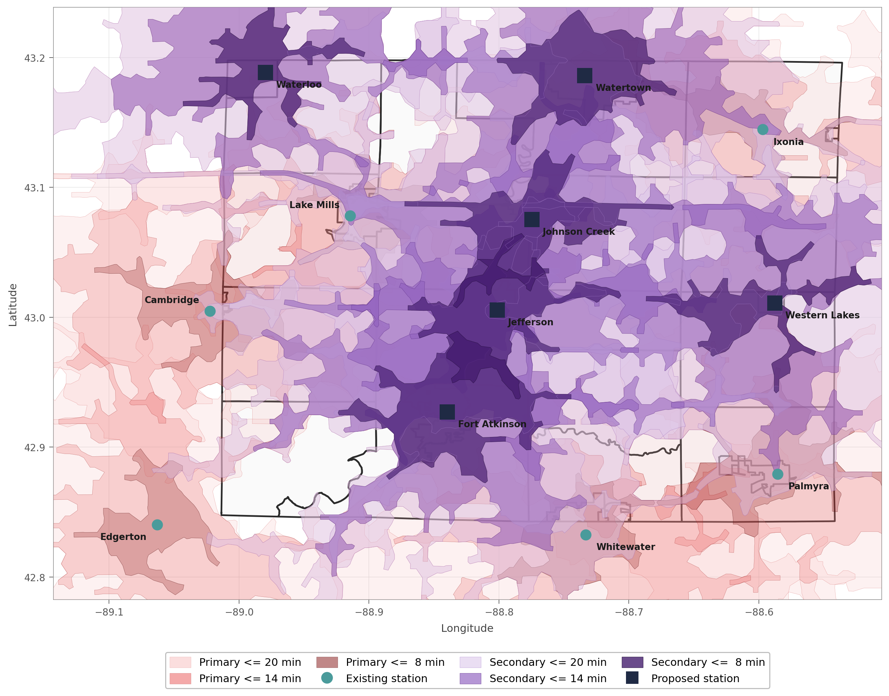
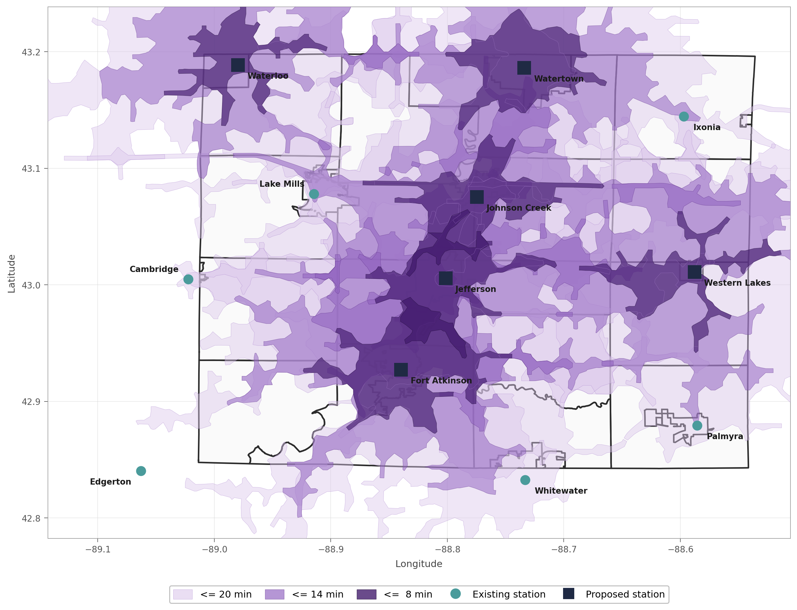

# Jefferson County EMS — Presentation Maps

Generated 2026-04-27. All maps render 12 existing primary stations (Helenville
excluded — first-responder agency, 0 ambulances, served by Jefferson EMS).
Proposed-station squares are snapped to existing-station coordinates so the
deck shows "second ambulance at this existing station," not at a grid point.

---

## Baseline — Current Primary Coverage

12 existing primary stations, red gradient. This is what every city keeps
under the proposal.

---

## K=3 — Add Secondary at 3 Existing Stations

**Fort Atkinson + Johnson Creek + Watertown**

### Overlay (primary red + proposed secondary purple)

### Isolated (proposed secondary only)

---

## K=4 — Add Secondary at 4 Existing Stations

**Fort Atkinson + Jefferson + Johnson Creek + Watertown**

### Overlay

### Isolated

---

## K=5 — Add Secondary at 5 Existing Stations

**Fort Atkinson + Jefferson + Johnson Creek + Waterloo + Watertown**

### Overlay

### Isolated

---

## K=6 — Add Secondary at 6 Existing Stations

**Fort Atkinson + Jefferson + Johnson Creek + Waterloo + Watertown + Western Lakes**

### Overlay

### Isolated

---

## File Index

| File | Description |
|---|---|
| `baseline_isochrone_map_presentation.png` | 12 existing primary stations, red gradient |
| `secondary_isochrone_map_K3_presentation.png` | K=3 overlay (red + purple) |
| `secondary_isochrone_map_K3_presentation_isolated.png` | K=3 purple only |
| `secondary_isochrone_map_K4_presentation.png` | K=4 overlay |
| `secondary_isochrone_map_K4_presentation_isolated.png` | K=4 purple only |
| `secondary_isochrone_map_K5_presentation.png` | K=5 overlay |
| `secondary_isochrone_map_K5_presentation_isolated.png` | K=5 purple only |
| `secondary_isochrone_map_K6_presentation.png` | K=6 overlay |
| `secondary_isochrone_map_K6_presentation_isolated.png` | K=6 purple only |

## Generating Scripts

- `baseline_isochrone_map_presentation.py`
- `secondary_isochrone_map_presentation.py`
