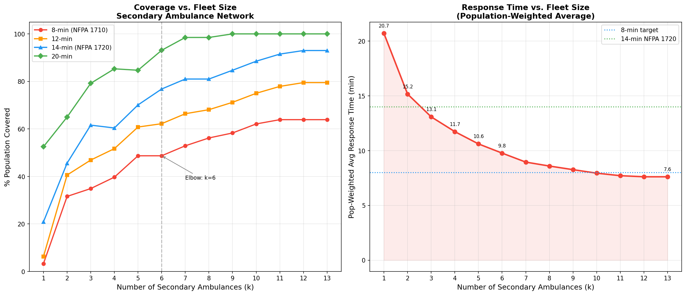
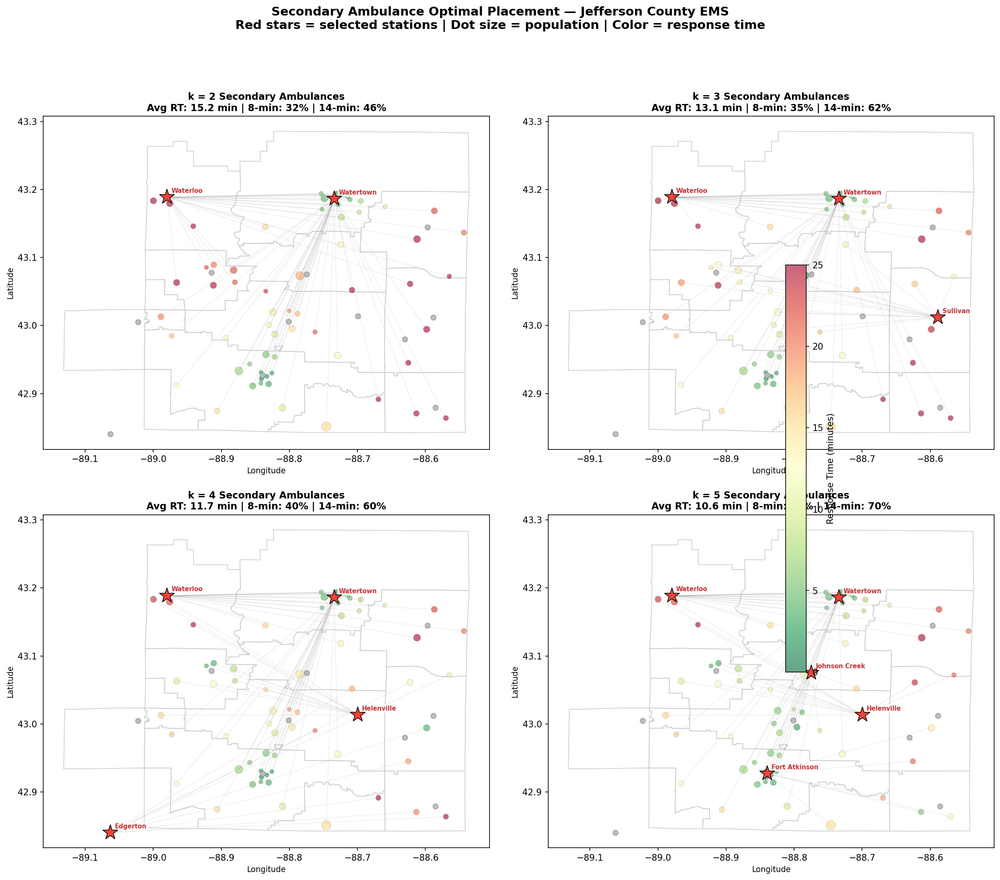

# Secondary Ambulance Facility Location Optimization
## Jefferson County EMS — Regional Secondary Ambulance Network

**Analysis Date**: March 25, 2026
**Method**: P-Median Integer Programming (PuLP/CBC solver)
**Data Sources**: ORS drive-time matrix (13 stations x 65 block groups), Census 2020 population, CY2024 NFIRS call data

---

## Executive Summary

This analysis determines the **optimal number and placement** of county-operated secondary ambulances to replace the current fragmented system where each of 13 municipalities independently maintains backup rigs at 10-15% utilization.

**Key finding**: **6 strategically placed secondary ambulances** can provide equivalent or better geographic coverage than the current 13-station distributed model, with:
- **49% of the population** within 8 minutes of a secondary unit
- **77% within 14 minutes** (NFPA 1720 rural standard)
- **Average population-weighted response time of 9.8 minutes**

Recommended sites: **Fort Atkinson, Helenville, Jefferson, Johnson Creek, Waterloo, Watertown**

---

## 1. Model Formulation

### Problem
Given k county-wide secondary ambulances, where should they be stationed to minimize population-weighted response time?

### Mathematical Model (P-Median)

**Sets:**
- I = 65 Census block group demand points (population-weighted)
- J = 13 candidate sites (existing EMS station locations)

**Parameters:**
- d_i = population at demand point i (total: 84,900)
- t_ij = ORS road-network drive time from station j to demand point i (minutes)

**Decision Variables:**
- x_j in {0,1}: 1 if station j houses a secondary ambulance
- y_ij in [0,1]: fraction of demand i assigned to station j

**Objective:**
```
minimize SUM_i SUM_j (d_i * t_ij * y_ij)
```

**Constraints:**
```
SUM_j x_j = k                    (exactly k ambulances)
SUM_j y_ij = 1  for all i        (every demand point served)
y_ij <= x_j    for all i,j       (assign only to open sites)
```

**Solver:** PuLP CBC (open-source), 120-second time limit per solve

---

## 2. Results: Coverage vs. Fleet Size

| k | Selected Sites | Avg RT (min) | Median RT | Max RT | 8-min | 10-min | 12-min | 14-min | 15-min | 20-min |
|---|---------------|-------------|----------|--------|-------|--------|--------|--------|--------|--------|
| 1 | Sullivan | 20.7 | 18.95 | 47.77 | 3.3% | 4.6% | 6.3% | 20.9% | 27.7% | 52.5% |
| 2 | Waterloo, Watertown | 15.16 | 13.35 | 37.47 | 31.6% | 38.3% | 40.6% | 45.6% | 49.9% | 65.0% |
| 3 | Sullivan, Waterloo, Watertown | 13.08 | 11.77 | 37.47 | 34.9% | 42.8% | 46.9% | 61.6% | 63.3% | 79.2% |
| 4 | Edgerton, Helenville, Waterloo, Watertown | 11.73 | 9.66 | 32.47 | 39.7% | 48.3% | 51.7% | 60.4% | 68.0% | 85.3% |
| 5 | Fort Atkinson, Helenville, Johnson Creek, Waterloo, Watertown | 10.61 | 7.88 | 25.33 | 48.7% | 56.4% | 60.8% | 70.1% | 72.1% | 84.7% |
| 6 | Fort Atkinson, Helenville, Jefferson, Johnson Creek, Waterloo, Watertown | 9.77 | 7.88 | 25.33 | 48.7% | 56.4% | 62.2% | 76.8% | 78.8% | 93.1% |
| 7 | Fort Atkinson, Helenville, Jefferson, Johnson Creek, Rome, Waterloo, Watertown | 8.95 | 7.65 | 20.82 | 52.9% | 60.5% | 66.4% | 81.0% | 83.0% | 98.5% |
| 8 | Fort Atkinson, Helenville, Jefferson, Johnson Creek, Rome, Sullivan, Waterloo, Watertown | 8.59 | 7.22 | 20.82 | 56.2% | 63.9% | 68.1% | 81.0% | 83.0% | 98.5% |
| 9 | Edgerton, Fort Atkinson, Helenville, Jefferson, Johnson Creek, Rome, Sullivan, Waterloo, Watertown | 8.26 | 7.09 | 18.66 | 58.3% | 65.9% | 71.2% | 84.7% | 84.7% | 100.0% |
| 10 | Edgerton, Fort Atkinson, Helenville, Ixonia, Jefferson, Johnson Creek, Rome, Sullivan, Waterloo, Watertown | 7.94 | 7.05 | 18.66 | 62.1% | 69.8% | 75.0% | 88.5% | 88.5% | 100.0% |
| 11 | Edgerton, Fort Atkinson, Helenville, Ixonia, Jefferson, Johnson Creek, Palmyra, Rome, Sullivan, Waterloo, Watertown | 7.71 | 6.61 | 18.66 | 63.9% | 71.5% | 77.9% | 91.5% | 91.5% | 100.0% |
| 12 | Cambridge, Edgerton, Fort Atkinson, Helenville, Ixonia, Jefferson, Johnson Creek, Palmyra, Rome, Sullivan, Waterloo, Watertown | 7.61 | 6.61 | 18.66 | 63.9% | 73.1% | 79.5% | 93.0% | 93.0% | 100.0% |
| 13 | Cambridge, Edgerton, Fort Atkinson, Helenville, Ixonia, Jefferson, Johnson Creek, Palmyra, Rome, Ryan Brothers, Sullivan, Waterloo, Watertown | 7.61 | 6.61 | 18.66 | 63.9% | 73.1% | 79.5% | 93.0% | 93.0% | 100.0% |

### Diminishing Returns

The coverage curve shows clear diminishing returns:
- **k=1 to k=3**: Each additional ambulance adds significant coverage
- **k=3 to k=5**: Moderate improvements, good cost-benefit sweet spot
- **k=5+**: Marginal gains per additional unit drop below 2-3% per ambulance

**Recommended fleet size: k=6** (elbow of the coverage curve)



---

## 3. Recommended Configuration: k=6

**Selected stations**: Fort Atkinson, Helenville, Jefferson, Johnson Creek, Waterloo, Watertown

| Metric | Value |
|--------|-------|
| Population-weighted avg RT | **9.8 min** |
| Max response time | 25.3 min |
| % Population within 8 min | **49%** |
| % Population within 14 min | **77%** |
| % Population within 20 min | 93% |

### Why These Locations?

The optimizer selects stations that **maximize geographic spread** while **weighting toward population centers**. The selected sites cover:
- Major population centers (cities/villages)
- Rural areas through overlapping coverage zones
- Key highway corridors for rapid deployment



---

## 4. Sensitivity Analysis

### 4a. Restricted to Large Municipalities Only

What if we only consider Watertown, Fort Atkinson, Jefferson, Whitewater, Edgerton as candidate sites?

| k | Sites | Avg RT (min) | 8-min Coverage | 14-min Coverage |
|---|-------|-------------|---------------|-----------------|
| 1 | Watertown | 23.53 | 15.7% | 25.3% |
| 2 | Jefferson, Watertown | 16.97 | 15.7% | 42.3% |
| 3 | Fort Atkinson, Jefferson, Watertown | 15.8 | 17.3% | 45.3% |
| 4 | Edgerton, Fort Atkinson, Jefferson, Watertown | 15.28 | 19.3% | 49.0% |

### 4b. Fort Atkinson Pre-Fixed

If Fort Atkinson must always have a county rig (due to central location + high volume), how does it change?

| k | Sites | Avg RT (min) | 8-min Coverage | 14-min Coverage |
|---|-------|-------------|---------------|-----------------|
| 1 | Fort Atkinson | 35.18 | 1.6% | 2.9% |
| 2 | Fort Atkinson, Sullivan | 18.22 | 4.9% | 23.8% |
| 3 | Fort Atkinson, Waterloo, Watertown | 13.86 | 33.2% | 48.6% |
| 4 | Fort Atkinson, Helenville, Waterloo, Watertown | 11.85 | 39.2% | 58.6% |
| 5 | Fort Atkinson, Helenville, Johnson Creek, Waterloo, Watertown | 10.61 | 48.7% | 70.1% |
| 6 | Fort Atkinson, Helenville, Jefferson, Johnson Creek, Waterloo, Watertown | 9.77 | 48.7% | 76.8% |
| 7 | Fort Atkinson, Helenville, Jefferson, Johnson Creek, Rome, Waterloo, Watertown | 8.95 | 52.9% | 81.0% |

---

## 5. Labor & Cost Estimation

### Staffing Models

| k | FTE (24/7) | FTE (Peak 09-21) | Cost 24/7 EMT | Cost 24/7 Paramedic | Cost Peak EMT |
|---|-----------|-----------------|--------------|-------------------|--------------|
| 1 | 4.8 | 2.4 | $334,000 | $415,600 | $202,000 |
| 2 | 9.6 | 4.8 | $668,000 | $831,200 | $404,000 |
| 3 | 14.4 | 7.2 | $1,001,999 | $1,246,800 | $606,000 |
| 4 | 19.2 | 9.6 | $1,336,000 | $1,662,400 | $808,000 |
| 5 | 24.0 | 12.0 | $1,670,000 | $2,078,000 | $1,010,000 |
| 6 | 28.8 | 14.4 | $2,003,999 | $2,493,600 | $1,212,000 |
| 7 | 33.6 | 16.8 | $2,338,000 | $2,909,200 | $1,414,000 |

**Assumptions:**
- EMT-Basic salary + benefits: $55,000/yr
- Paramedic salary + benefits: $72,000/yr
- Ambulance annual operating cost: $35,000/yr (maintenance, fuel, insurance)
- New ambulance purchase: $350,000 (amortized over 10 years)
- 24/7 staffing: 2-person crew, 12-hour shifts, 1.2 relief factor = 4.8 FTE per unit
- Peak-only staffing: 12-hour shift (09:00-21:00) = 2.4 FTE per unit

### Cost Comparison

**Current system (estimated):**
- ~13 municipalities each maintaining secondary ambulance capacity
- Mix of part-time, on-call, volunteer staffing
- Estimated $50,000-$100,000 per municipality in secondary rig overhead
- County-wide total: **$650,000 - $1,300,000/yr** for 10-15% utilization

**Proposed county system (k=6, peak staffing):**
- 6 ambulances, peak hours only (09:00-21:00)
- FTE needed: 14.4
- Annual cost: **$1,212,000**
- Covers 77% of population within 14 minutes
- Utilization per unit: ~248 secondary calls/yr (0.7/day)

---

## 6. Municipalities That Benefit Most

Small rural departments with low call volumes benefit disproportionately from a county secondary network because they currently cannot reliably staff a backup rig:

| Municipality | Annual Calls | Current Secondary | Benefit from County Model |
|-------------|-------------|------------------|--------------------------|
| Cambridge | 87 | None (service disrupted 2025) | **Critical** — no backup at all |
| Palmyra | 32 | Volunteer, BLS only | **High** — can't staff ALS backup |
| Ixonia | 289 | Single rig, no backup | **High** — single-point-of-failure |
| Waterloo | 520 | 2005 rig (20 yrs old, CRITICAL) | **High** — aging fleet, 4 FT staff |
| Johnson Creek | 487 | On-call from home (~9% usage) | **Moderate** — informal system works but fragile |
| Lake Mills | 518 | Ryan Bros contract | **Moderate** — outsourced already |
| Jefferson | 1,457 | 5 rigs but only 6 FT staff | **Moderate** — equipment exists, staffing is thin |

---

## 7. Implementation Considerations

### Dispatch Algorithm

When a municipality's primary ambulance is on a call and a second call arrives:

1. **Dispatch nearest available county ambulance** (by real-time drive time)
2. **If multiple county units equidistant**: prefer the unit whose departure leaves the least coverage gap county-wide ("preparedness-based dispatch")
3. **ALS vs BLS**: Route ALS county units to higher-acuity calls; BLS-level calls can go to any available unit
4. **Night hours**: If running peak-only model (09:00-21:00), overnight secondary calls revert to mutual aid (existing MABAS agreements)

### Contract Provisions

Key contracts already contemplate county-wide consolidation:
- **Fort Atkinson-Koshkonong (Section 6)**: Agreement reopens if county adopts county-wide system
- **Jefferson contracts (Aztalan, Farmington, Hebron, Oakland)**: Explicit clause for county-wide renegotiation
- **Watertown-Milford**: Mutual aid fallback already normalized in contract

### Phased Rollout

1. **Phase 1**: Place 2 county ambulances at the two highest-impact locations (pilot)
2. **Phase 2**: Expand to 6 units after pilot validation
3. **Phase 3**: Evaluate 24/7 vs peak-only based on utilization data from Phases 1-2

---

## Data Sources & Methodology

- **Drive times**: OpenRouteService Matrix API (real road-network times, cached Mar 2026)
- **Population**: Census 2020 Decennial (65 block groups, 84,900 total)
- **Call volumes**: CY2024 NFIRS (14,853 EMS calls) + authoritative ground-truth counts
- **Secondary call rate**: 10% (based on Johnson Creek chief: 70/750 = 9.3%, rounded up)
- **Station coordinates**: Jefferson County GIS (jefferson_stations.geojson)
- **Solver**: PuLP CBC (open-source integer programming), <2 min per solve

*This analysis is diagnostic. Station selection identifies optimal locations based on current data. Actual deployment requires coordination with municipal fire chiefs, county board approval, dispatch protocol changes, and MABAS agreement updates.*
